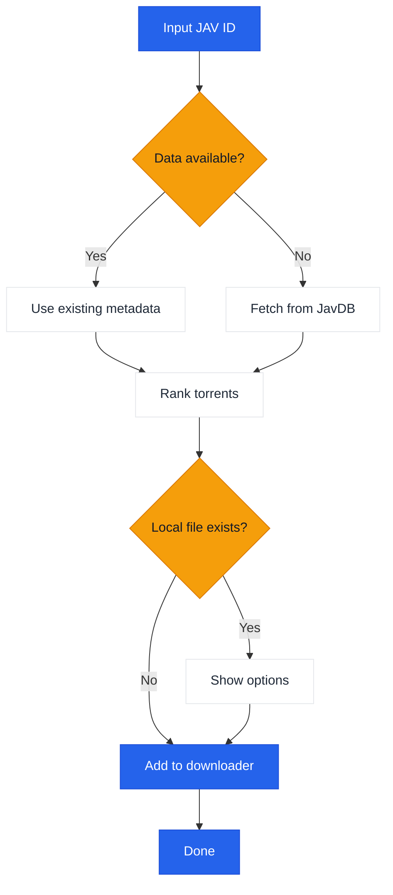

# JavManager

軽量なGUI + CLIツールで、JAVコンテンツの自動管理、高速なリピート検索、トレント検索、およびオプションでqBittorrentとの統合を提供します。

[中文](README.zh-CN.md) | [日本語](README.ja.md) | [한국어](README.ko.md)

> **注意:** Everything（ローカル検索）とqBittorrent（ダウンロード）はオプションの統合機能です。これらがなくてもJavManagerは動作します（JavDBの検索とマグネットリンクの出力は可能です）。他のHTTP APIをサポートするツール（他の検索エンジンやダウンロードクライアントなど）が必要な場合は、[Issueを作成してください](../../issues/new)。

## 機能

- GUI（Avalonia）とコンソールモード（Spectre.Console）
- 多言語GUI（英語、中国語、日本語、韓国語）
- JavDBからのJAVメタデータとトレント/マグネットの検索
- Everything検索エンジンによるローカルファイルの確認
- qBittorrent WebUI API経由でのダウンロード
- リピート検索用のローカルJSONキャッシュ
- 重みベースのランキングによるスマートなトレント選択（マーカー+重み）

## ワークフロー



## 外部依存関係

| サービス | 必須 | 目的 | リンク |
|---------|----------|---------|------|
| JavDB | はい | メタデータとマグネットリンク | [javdb.com](https://javdb.com/) |
| Everything | いいえ（オプション） | ローカルファイル検索 | [voidtools.com](https://www.voidtools.com/everything-1.5a/) ([HTTPプラグイン](https://www.voidtools.com/forum/viewtopic.php?f=12&t=9799)) |
| qBittorrent | いいえ（オプション） | トレントダウンロード | [qBittorrent](https://github.com/qbittorrent/qBittorrent) |

### Cloudflare 403問題

JavDBがHTTP 403を返す場合、それはおそらくCloudflareのチャレンジによるものです。JavManagerはデフォルトで**curl-impersonateを使用して**、実際のブラウザのTLS/HTTP2フィンガープリントを模倣します（ブラウザ自動化は使用しません）。それでも403が表示される場合は、別のミラーURLを試すか、IPがブロックされていないか確認してください（`doc/CloudflareBypass.md`を参照）。

### JavDBドメインAPI

Cloudflare Workerは、公式サイトから最新のJavDBドメインを取得するAPIエンドポイントを提供します：

**エンドポイント:** `GET /api/javdb-domain`

**リクエスト例:**
```bash
curl https://your-worker-url/api/javdb-domain
```

**レスポンス例:**
```json
{
  "success": true,
  "domains": ["javdb565.com"]
}
```

**エラーレスポンス:**
```json
{
  "success": false,
  "error": "Failed to fetch domain from javdb.com",
  "message": "Could not extract latest domain from javdb.com"
}
```

このAPIは`https://javdb.com/`からリアルタイムで最新のJavDBドメインを取得します。APIには10秒のタイムアウトと適切なエラー処理が含まれています。

### テレメトリ + "Jav Trends"（オプション）

`Telemetry:Enabled`がtrueの場合、JavManagerは以下を投稿できます：

- `POST /api/telemetry`への起動イベント
- `POST /api/javinfo`へのJAVメタデータ（ワーカーUIで使用；重複したレポートはIDごとの検索カウンターをインクリメント）

ワーカーは小さなUIも提供します：

- `/` 概要
- `/jav` "Jav Trends"（最近のJavInfoレコード+検索カウント）

## 設定

設定は`appsettings.json`（およびオプションで`appsettings.Development.json`）を介して行われます。

- 開発: `JavManager/appsettings.json`を編集（`bin/Debug/net10.0/appsettings.json`にコピーされます）。
- リリース/単一ファイル: アプリは初回実行時に実行ファイルの隣に（存在しない場合は作成して）`appsettings.json`を読み込みます。

設定リファレンス：

| セクション | キー | 必須 | デフォルト | 説明 |
|---------|-----|----------|---------|-------------|
| Everything | `BaseUrl` | いいえ（オプション） | _(空)_ | Everything HTTPサーバーのベースURL（スキームとホストを含む）。利用できない場合、ローカル重複排除はスキップされます。 |
| Everything | `UserName` | いいえ（オプション） | _(空)_ | Basic認証のユーザー名。 |
| Everything | `Password` | いいえ（オプション） | _(空)_ | Basic認証のパスワード。 |
| QBittorrent | `BaseUrl` | いいえ（オプション） | _(空)_ | qBittorrent WebUIのベースURL（必要に応じてポートを含む）。利用できない/認証に失敗した場合、JavManagerはマグネットリンクを印刷するだけでダウンロードキューには追加しません。 |
| QBittorrent | `UserName` | いいえ（オプション） | _(空)_ | WebUIのユーザー名。 |
| QBittorrent | `Password` | いいえ（オプション） | _(空)_ | WebUIのパスワード。 |
| JavDb | `BaseUrl` | はい | `https://javdb.com` | プライマリJavDBベースURL。 |
| JavDb | `MirrorUrls` | いいえ（オプション） | `[]` | 追加のミラーURL（配列）。 |
| JavDb | `RequestTimeout` | いいえ（オプション） | `30000` | リクエストタイムアウト（ミリ秒）。 |
| JavDb | `UserAgent` | いいえ（オプション） | _(空)_ | カスタムUser-Agent文字列（HttpClientフォールバックモードでのみ使用）。 |
| JavDb | `CurlImpersonate:Enabled` | いいえ（オプション） | `true` | JavDBリクエストでcurl-impersonateを有効にする（推奨）。 |
| JavDb | `CurlImpersonate:Target` | いいえ（オプション） | `chrome116` | `curl_easy_impersonate()`の偽装ターゲット名（例: `chrome116`）。 |
| JavDb | `CurlImpersonate:LibraryPath` | いいえ（オプション） | _(空)_ | `libcurl.dll`へのオプションの明示的なパス（そうでない場合は自動検出）。 |
| JavDb | `CurlImpersonate:CaBundlePath` | いいえ（オプション） | _(空)_ | `cacert.pem`へのオプションのパス（そうでない場合は自動検出）。 |
| JavDb | `CurlImpersonate:DefaultHeaders` | いいえ（オプション） | `true` | curl-impersonateの組み込みデフォルトHTTPヘッダーを使用する。 |
| Download | `DefaultSavePath` | いいえ（オプション） | _(空)_ | qBittorrentにトレントを追加するときのデフォルト保存パス。 |
| Download | `DefaultCategory` | いいえ（オプション） | `jav` | qBittorrentのデフォルトカテゴリ。 |
| Download | `DefaultTags` | いいえ（オプション） | `jav-manager` | 作成されたダウンロードのデフォルトタグ。 |
| LocalCache | `Enabled` | いいえ（オプション） | `true` | ローカルキャッシュストレージを有効または無効にする。 |
| LocalCache | `DatabasePath` | いいえ（オプション） | _(空)_ | JSONキャッシュファイルパス（空のままにすると実行ファイルの隣のデフォルトの`jav_cache.json`が使用される）。 |
| LocalCache | `CacheExpirationDays` | いいえ（オプション） | `0` | キャッシュのTTL（日数）（0は期限切れを無効にする）。 |
| Console | `Language` | いいえ（オプション） | `en` | UI言語（`en`、`zh`、または`auto`）。 |
| Console | `HideOtherTorrents` | いいえ（オプション） | `true` | リスト内の非一致トレントを非表示にする。 |
| Telemetry | `Enabled` | いいえ（オプション） | `true` | 匿名テレメトリを有効または無効にする。 |
| Telemetry | `Endpoint` | いいえ（オプション） | `https://jav-manager.techfetch.dev` | ベースエンドポイント（アプリは`/api/telemetry`と`/api/javinfo`に投稿する）。 |
| Update | `Enabled` | いいえ（オプション） | `true` | アップデートチェックを有効または無効にする。 |
| Update | `AutoCheckOnStartup` | いいえ（オプション） | `true` | 起動時に自動でアップデートをチェックする（GUI）。 |
| Update | `GitHubRepo` | いいえ（オプション） | `jqknono/jav-manager` | アップデートチェックに使用するGitHubリポジトリ。 |

注記：
- `JavInfoSync:*`は古いセクション名です。新しいビルドでは`Telemetry:*`を使用します（アプリは後方互換性のために古いキーも読み取ります）。
- 上級者向け：設定は`JAVMANAGER_`プレフィックスを使用した環境変数もサポートします（入れ子のキーは`__`を使用しますが）、ファイルベースの設定が主要なサポート方法です。

## 使用方法

```bash
# GUI（引数なしのデフォルト）
dotnet run --project JavManager/JavManager.csproj

# コンソール（対話型）
dotnet run --project JavManager/JavManager.csproj -- --no-gui

# コンソール（非対話型）
dotnet run --project JavManager/JavManager.csproj -- STARS-001

# ヘルプを表示
dotnet run --project JavManager/JavManager.csproj -- help

# バージョンを表示
dotnet run --project JavManager/JavManager.csproj -- version
```

コンソールコマンドについては、`dotnet run --project JavManager/JavManager.csproj -- help`を実行してください。

## ビルドとパッケージ化

```bash
# ビルド
dotnet build JavManager/JavManager.csproj

# テストを実行
dotnet test JavManager.Tests/JavManager.Tests.csproj

# 公開（マルチRID、自己完結型、出力先はartifacts/publish/<rid>/）
pwsh scripts/publish.ps1

# PATHにインストール（Windows）
pwsh scripts/install-windows.ps1 -AddToPath
```

### Android（実験的）

Androidビルドはオプトインです（デスクトップビルドがAndroidワークロードを必要としないように）。

```bash
# ワークロードをインストール（1回のみ）
dotnet workload install android

# Androidターゲットをビルド（Android SDK/JDKが設定されている必要があります）
dotnet build JavManager/JavManager.csproj -c Debug -f net10.0-android -p:EnableAndroid=true
```