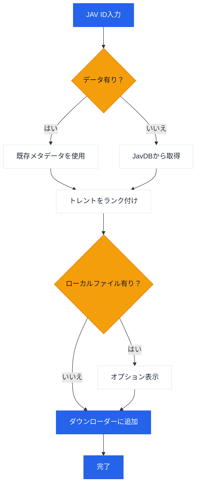

# JavManager

JAVコンテンツを自動管理するコマンドラインツール。高速な重複検索、トレント検索、qBittorrent連携機能を備えています。

[中文](README.zh-CN.md) | [日本語](README.ja.md) | [한국어](README.ko.md)

> **注意:** 現在サポートしているのはEverything（ローカル検索）とqBittorrent（ダウンロード）です。HTTP APIを提供する他のツール（検索エンジンやダウンロードクライアントなど）のサポートが必要な場合は、[issueを作成](../../issues/new)してください。

## 特徴

- JavDBからJAVメタデータとマグネットリンクを検索
- 高速検索
- Everything検索エンジンによるローカルファイルのチェック
- qBittorrent WebUI API経由でのダウンロード
- 重み付けランキングによるインテリジェントなトレント選択

## ワークフロー



## 外部依存サービス

| サービス | 目的 | リンク |
|---------|---------|------|
| Everything | ローカルファイル検索 | [voidtools.com](https://www.voidtools.com/everything-1.5a/) ([HTTPプラグイン](https://www.voidtools.com/forum/viewtopic.php?f=12&t=9799)) |
| JavDB | メタデータ＆マグネットリンク | [javdb.com](https://javdb.com/) |
| qBittorrent | トレントダウンロード | [qBittorrent](https://github.com/qbittorrent/qBittorrent) |

### Cloudflare 403 問題

JavDBがHTTP 403を返す場合、Cloudflareチャレンジが原因である可能性があります。JavManagerはChromeライクなヘッダーを使用し、サードパーティツールなしでリトライします。それでも403が表示される場合は、ブラウザから`cf_clearance`と対応する`UserAgent`を設定してください（`doc/CloudflareBypass.md`参照）。

## 設定

すべての設定は`JavManager/appsettings.json`で構成します（ローカル上書きには`appsettings.Development.json`を使用）。環境変数による上書きはサポートされていません。

### Everything

- `BaseUrl`: Everything HTTPサーバーのベースURL（スキームとホストを含む）
- `UserName`: オプションのベーシック認証ユーザー名
- `Password`: オプションのベーシック認証パスワード

### QBittorrent

- `BaseUrl`: qBittorrent WebUIベースURL（必要な場合はポートを含む）
- `UserName`: WebUIユーザー名
- `Password`: WebUIパスワード

### JavDb

- `BaseUrl`: メインのJavDBベースURL
- `MirrorUrls`: 追加ミラーURL（配列）
- `RequestTimeout`: リクエストタイムアウト（ミリ秒）
- `CfClearance`: `cf_clearance`クッキー値
- `CfBm`: `__cf_bm`クッキー値（オプション）
- `UserAgent`: クッキー取得元と一致するブラウザのUser-Agent文字列

### Download

- `DefaultSavePath`: トレントのデフォルト保存パス
- `DefaultCategory`: qBittorrentでのデフォルトカテゴリ/タグ
- `DefaultTags`: 作成されるダウンロードのデフォルトタグ

### LocalCache

- `Enabled`: ローカルキャッシュ保存の有効/無効
- `DatabasePath`: カスタムデータベースパス（空の場合はデフォルト）
- `CacheExpirationDays`: キャッシュのTTL（日数、0で無効）

### Console

- `Language`: UI言語（`en` または `zh`）
- `HideOtherTorrents`: リストで一致しないトレントを非表示にする

### Telemetry

- `Enabled`: 匿名テレメトリの有効/無効
- `Endpoint`: テレメトリエンドポイントURL

### JavInfoSync

- `Enabled`: JavInfo同期の有効/無効
- `Endpoint`: JavInfo同期エンドポイントURL
- `ApiKey`: オプションのAPIキー（エンドポイントで必要な場合）

## 使用方法

```bash
# インタラクティブモード
dotnet run --project JavManager/JavManager.csproj

# 直接検索
dotnet run --project JavManager/JavManager.csproj -- STARS-001

# ヘルプ表示
dotnet run --project JavManager/JavManager.csproj -- help

# バージョン表示
dotnet run --project JavManager/JavManager.csproj -- version
```

**インタラクティブコマンド:**

| コマンド | 説明 |
|---------|-------------|
| `<コード>` | JAVコードで検索（例：`STARS-001`） |
| `r <コード>` | 検索をリフレッシュ|
| `c` | 保存済みデータの統計を表示 |
| `h` | ヘルプを表示 |
| `q` | 終了 |

## ビルド＆パッケージ

```bash
# ビルド
dotnet build JavManager/JavManager.csproj

# テスト実行
dotnet test JavManager.Tests/JavManager.Tests.csproj

# パッケージ化（Windowsスタンドアローンzip）
pwsh scripts/package.ps1

# PATHへのインストール（Windows）
pwsh scripts/install-windows.ps1 -AddToPath
```