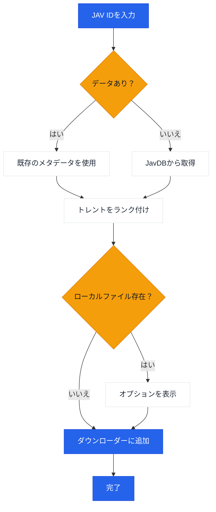

# JavManager

JAVコンテンツ管理を自動化する軽量なGUI + CLIツール。高速な重複検索、トレント検索、オプションのqBittorrent連携を備えています。

[繁體中文](README.zh-TW.md) | [日本語](README.ja.md) | [한국어](README.ko.md)

## 使用方法

```bash
# GUI
npx jav-manager --gui

# CLI (インタラクティブ)
npx jav-manager

# CLI (非インタラクティブ)
npx jav-manager STARS-001

# ヘルプ / バージョン
npx jav-manager help
npx jav-manager version
```

注意点:
- Everything（ローカル検索）とqBittorrent（ダウンロード）はオプションの連携機能です。これらがなくてもJavManagerは動作します（JavDBの検索やマグネットリンクの出力は可能です）。
- グローバルインストール（`npm install -g jav-manager`）している場合は、`npx jav-manager`を`jav-manager`に置き換えてください。
- HTTP APIを持つ他のツール（他の検索エンジンやダウンロードクライアントなど）のサポートが必要な場合は、[Issueを作成](../../issues/new)してください。

## 機能

- GUI（ローカルWeb UI）およびコンソールモード（Node.js）
- 多言語UI（英語、中国語、日本語、韓国語）
- JavDBからJAVメタデータおよびトレント/マグネットを検索
- Everything検索エンジン経由でローカルファイルを確認
- qBittorrent WebUI API経由でダウンロード
- 再検索用のローカルJSONキャッシュ
- 重み付けランキングによるスマートなトレント選択（マーカー + 重み）

## ワークフロー



## 外部依存関係

| サービス | 必須 | 目的 | リンク |
|---------|----------|---------|------|
| JavDB | はい | メタデータとマグネットリンク | [javdb.com](https://javdb.com/) |
| Everything | いいえ (オプション) | ローカルファイル検索 | [voidtools.com](https://www.voidtools.com/everything-1.5a/) ([HTTPプラグイン](https://www.voidtools.com/forum/viewtopic.php?f=12&t=9799)) |
| qBittorrent | いいえ (オプション) | トレントダウンロード | [qBittorrent](https://github.com/qbittorrent/qBittorrent) |

### Cloudflare 403の問題

JavDBがHTTP 403を返す場合、Cloudflareのチャレンジによる可能性があります。JavManagerはデフォルトで**curl-impersonate**を使用し、実際のブラウザのTLS/HTTP2フィンガープリントを模倣します（ブラウザ自動化は不要）。それでも403が表示される場合は、別のミラーURLを試すか、IPがブロックされていないか確認してください（`doc/CloudflareBypass.md`を参照）。

### JavDBドメインAPI

Cloudflare Workerは、公式サイトから最新のJavDBドメインを取得するためのAPIエンドポイントを提供します：

**エンドポイント:** `GET /api/javdb-domain`

**リクエスト例:**
```bash
curl https://your-worker-url/api/javdb-domain
```

**レスポンス例:**
```json
{
  "success": true,
  "domains": ["javdb565.com"]
}
```

**エラーレスポンス:**
```json
{
  "success": false,
  "error": "Failed to fetch domain from javdb.com",
  "message": "Could not extract latest domain from javdb.com"
}
```

このAPIは、`https://javdb.com/`から最新のJavDBドメインをリアルタイムで取得します。APIには10秒のタイムアウトと適切なエラーハンドリングが含まれています。

### テレメトリ + "Jav Trends"（オプション）

`Telemetry:Enabled`がtrueの場合、JavManagerは以下を送信できます：

- `POST /api/telemetry`への起動イベント
- `POST /api/javinfo`へのJAVメタデータ（Worker UIで使用されます；重複報告はIDごとの検索カウンターを増加させます）

Workerは小さなUIも提供します：

- `/` 概要
- `/jav` "Jav Trends"（最近のJavInfoレコード + 検索回数）

## 設定

設定は`appsettings.json`（およびオプションの`appsettings.Development.json`）を介して行われます。

設定ファイルの場所:
- `JAVMANAGER_CONFIG_DIR`が設定され存在する場合、そこから設定が読み込まれます。
- そうでない場合、JavManagerはまず実行可能ファイルのディレクトリ、次に現在の作業ディレクトリで`appsettings.json`を探します。
- GUIの「設定」およびCLIの`cfg set ...`は、選択された設定ディレクトリに`appsettings.json`を書き込みます（上記の検索ルールを参照）。

設定リファレンス:

| セクション | キー | 必須 | デフォルト | 説明 |
|---------|-----|----------|---------|-------------|
| Everything | `BaseUrl` | いいえ (オプション) | _(空)_ | Everything HTTPサーバーのベースURL（スキームとホストを含む）。利用不可の場合、ローカル重複排除はスキップされます。 |
| Everything | `UserName` | いいえ (オプション) | _(空)_ | Basic認証ユーザー名。 |
| Everything | `Password` | いいえ (オプション) | _(空)_ | Basic認証パスワード。 |
| QBittorrent | `BaseUrl` | いいえ (オプション) | _(空)_ | qBittorrent WebUIベースURL（必要に応じてポートを含む）。利用不可または認証失敗の場合、JavManagerはダウンロードキューに追加せずにマグネットリンクを出力します。 |
| QBittorrent | `UserName` | いいえ (オプション) | _(空)_ | WebUIユーザー名。 |
| QBittorrent | `Password` | いいえ (オプション) | _(空)_ | WebUIパスワード。 |
| JavDb | `BaseUrl` | はい | `https://javdb.com` | プライマリJavDBベースURL。 |
| JavDb | `MirrorUrls` | いいえ (オプション) | `[]` | 追加のミラーURL（配列）。 |
| JavDb | `RequestTimeout` | いいえ (オプション) | `30000` | リクエストタイムアウト（ミリ秒）。 |
| JavDb | `UserAgent` | いいえ (オプション) | _(空)_ | カスタムUser-Agent文字列（HttpClientフォールバックモードでのみ使用）。 |
| JavDb | `CurlImpersonate:Enabled` | いいえ (オプション) | `true` | JavDBリクエストに対してcurl-impersonateを有効にします（推奨）。 |
| JavDb | `CurlImpersonate:Target` | いいえ (オプション) | `chrome116` | `curl_easy_impersonate()`の偽装ターゲット名（例: `chrome116`）。 |
| JavDb | `CurlImpersonate:LibraryPath` | いいえ (オプション) | _(空)_ | `libcurl.dll`へのオプションの明示的パス（指定しない場合は自動検出）。 |
| JavDb | `CurlImpersonate:CaBundlePath` | いいえ (オプション) | _(空)_ | `cacert.pem`へのオプションのパス（指定しない場合は自動検出）。 |
| JavDb | `CurlImpersonate:DefaultHeaders` | いいえ (オプション) | `true` | curl-impersonate組み込みのデフォルトHTTPヘッダーを使用します。 |
| Download | `DefaultSavePath` | いいえ (オプション) | _(空)_ | qBittorrentにトレントを追加する際のデフォルトの保存パス。 |
| Download | `DefaultCategory` | いいえ (オプション) | `jav` | qBittorrentのデフォルトカテゴリ。 |
| Download | `DefaultTags` | いいえ (オプション) | `jav-manager` | 作成されたダウンロードのデフォルトタグ。 |
| LocalCache | `Enabled` | いいえ (オプション) | `true` | ローカルキャッシュストレージを有効または無効にします。 |
| LocalCache | `DatabasePath` | いいえ (オプション) | _(空)_ | JSONキャッシュファイルのパス（デフォルトの`jav_cache.json`を実行可能ファイルの隣に使用する場合は空のままにします）。 |
| LocalCache | `CacheExpirationDays` | いいえ (オプション) | `0` | キャッシュのTTL（日数）（0で無期限）。 |
| Console | `Language` | いいえ (オプション) | `en` | UI言語（`en`または`zh`）。 |
| Console | `HideOtherTorrents` | いいえ (オプション) | `true` | リスト内の一致しないトレントを非表示にします。 |
| Telemetry | `Enabled` | いいえ (オプション) | `true` | 匿名テレメトリを有効または無効にします。 |
| Telemetry | `Endpoint` | いいえ (オプション) | `https://jav-manager.techfetch.dev` | ベースエンドポイント（アプリは`/api/telemetry`と`/api/javinfo`にPOSTします）。 |
| Update | `Enabled` | いいえ (オプション) | `true` | アップデートチェックを有効または無効にします。 |
| Update | `AutoCheckOnStartup` | いいえ (オプション) | `true` | 起動時にアップデートを自動チェック（GUI）。 |
| Update | `GitHubRepo` | いいえ (オプション) | `jqknono/jav-manager` | アップデートチェックに使用されるGitHubリポジトリ。 |

注意点:
- `JavInfoSync:*`はレガシーのセクション名です。新しいビルドでは`Telemetry:*`を使用します（アプリは後方互換性のためにレガシーキーも読み取ります）。
- 詳細：設定は`JAVMANAGER_`プレフィックスを持つ環境変数もサポートします（ネストされたキーは`__`を使用）が、ファイルベースの設定が主にサポートされる方法です。

## 開発

```bash
# 依存関係をインストール
npm install

# ビルド
npm run build

# 実行 (GUI / CLI)
npm run gui
npm run cli

# 実行 (コンパイル済みデフォルトエントリ)
npm run start

# テスト
npm test
```