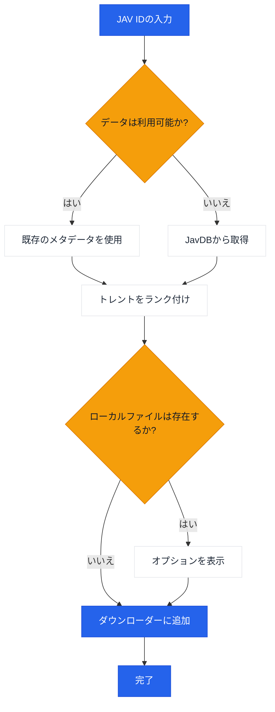

# JavManager

JAVコンテンツの自動管理を行うコマンドラインツール。高速な重複検索、トレント検索、qBittorrent統合機能を備えています。

[中文](README.zh-CN.md) | [日本語](README.ja.md) | [한국어](README.ko.md)

> **注意:** Everything（ローカル検索）とqBittorrent（ダウンロード）はオプションの統合機能です。これらがなくてもJavManagerは動作します（JavDBの検索とマグネットリンクの出力は可能です）。他のHTTP APIをサポートするツール（例：他の検索エンジンやダウンロードクライアント）が必要な場合は、[issueを作成してください](../../issues/new)。

## 機能

- JavDBからのJAVメタデータとマグネットリンクの検索
- 高速検索
- Everything検索エンジンによるローカルファイルの確認
- qBittorrent WebUI APIによるダウンロード
- 重みベースのランキングによるスマートなトレント選択

## ワークフロー



## 外部依存関係

| サービス | 必須 | 目的 | リンク |
|---------|----------|---------|------|
| JavDB | はい | メタデータとマグネットリンク | [javdb.com](https://javdb.com/) |
| Everything | いいえ（オプション） | ローカルファイル検索 | [voidtools.com](https://www.voidtools.com/everything-1.5a/) ([HTTPプラグイン](https://www.voidtools.com/forum/viewtopic.php?f=12&t=9799)) |
| qBittorrent | いいえ（オプション） | トレントダウンロード | [qBittorrent](https://github.com/qbittorrent/qBittorrent) |

### Cloudflare 403問題

JavDBがHTTP 403を返す場合、それはおそらくCloudflareのチャレンジによるものです。JavManagerは組み込みのChromeライクなヘッダーを使用し、サードパーティツールなしでリトライします。それでも403が表示される場合は、ブラウザから取得した`cf_clearance`と一致する`UserAgent`を構成してください（`doc/CloudflareBypass.md`を参照）。

## 設定

すべての設定は`JavManager/appsettings.json`で構成されます（ローカルのオーバーライドには`appsettings.Development.json`を使用）。環境変数のオーバーライドはサポートされていません。

設定リファレンス:

| セクション | キー | 必須 | デフォルト | 説明 |
|---------|-----|----------|---------|-------------|
| Everything | `BaseUrl` | いいえ（オプション） | `http://localhost` | Everything HTTPサーバーのベースURL（スキームとホストを含む）。利用できない場合、ローカルの重複排除はスキップされます。 |
| Everything | `UserName` | いいえ（オプション） | _(空)_ | ベーシック認証のユーザー名。 |
| Everything | `Password` | いいえ（オプション） | _(空)_ | ベーシック認証のパスワード。 |
| QBittorrent | `BaseUrl` | いいえ（オプション） | `http://localhost:8080` | qBittorrent WebUIのベースURL（必要に応じてポートを含む）。利用できない/認証に失敗した場合、JavManagerはマグネットリンクを表示するのみでダウンロードキューには追加しません。 |
| QBittorrent | `UserName` | いいえ（オプション） | `admin` | WebUIのユーザー名。 |
| QBittorrent | `Password` | いいえ（オプション） | _(空)_ | WebUIのパスワード。 |
| JavDb | `BaseUrl` | はい | `https://javdb.com` | プライマリJavDBのベースURL。 |
| JavDb | `MirrorUrls` | いいえ（オプション） | `[]` | 追加のミラーURL（配列）。 |
| JavDb | `RequestTimeout` | いいえ（オプション） | `30000` | リクエストタイムアウト（ミリ秒）。 |
| JavDb | `CfClearance` | 時々 | _(空)_ | `cf_clearance`クッキー値（Cloudflareチャレンジがアクティブなときに必要）。 |
| JavDb | `CfBm` | いいえ（オプション） | _(空)_ | `__cf_bm`クッキー値（オプション；成功率を向上させる可能性あり）。 |
| JavDb | `UserAgent` | 時々 | _(空)_ | クッキーのソースに一致するブラウザのUser-Agent文字列（Cloudflareクッキーを使用するときに必要）。 |
| Download | `DefaultSavePath` | いいえ（オプション） | _(空)_ | qBittorrentにトレントを追加するときのデフォルト保存パス。 |
| Download | `DefaultCategory` | いいえ（オプション） | `jav` | qBittorrentのデフォルトカテゴリ。 |
| Download | `DefaultTags` | いいえ（オプション） | `auto-download` | 作成されたダウンロードのデフォルトタグ。 |
| LocalCache | `Enabled` | いいえ（オプション） | `true` | ローカルキャッシュストレージの有効化または無効化。 |
| LocalCache | `DatabasePath` | いいえ（オプション） | _(空)_ | JSONキャッシュファイルパス（空のままにすると実行ファイルの隣のデフォルトの`jav_cache.json`が使用されます）。 |
| LocalCache | `CacheExpirationDays` | いいえ（オプション） | `0` | キャッシュのTTL（日数）（0は期限切れを無効化）。 |
| Console | `Language` | いいえ（オプション） | `en` | UI言語（`en`、`zh`、または`auto`）。 |
| Console | `HideOtherTorrents` | いいえ（オプション） | `true` | リスト内の一致しないトレントを非表示にする。 |
| Telemetry | `Enabled` | いいえ（オプション） | `true` | 匿名テレメトリの有効化または無効化。 |
| Telemetry | `Endpoint` | いいえ（オプション） | _(空)_ | テレメトリエンドポイントURL（空のままにするとデフォルトが使用されます）。 |
| JavInfoSync | `Enabled` | いいえ（オプション） | `false` | JavInfo同期の有効化または無効化。 |
| JavInfoSync | `Endpoint` | 有効化時 | _(空)_ | JavInfo同期エンドポイントURL。 |
| JavInfoSync | `ApiKey` | いいえ（オプション） | _(空)_ | オプションのAPIキー（`X-API-Key`で送信）。 |

## 使用方法

```bash
# 対話モード
dotnet run --project JavManager/JavManager.csproj

# 直接検索
dotnet run --project JavManager/JavManager.csproj -- STARS-001

# ヘルプを表示
dotnet run --project JavManager/JavManager.csproj -- help

# バージョンを表示
dotnet run --project JavManager/JavManager.csproj -- version
```

**対話コマンド:**

| コマンド | 説明 |
|---------|-------------|
| `<code>` | JAVコードで検索（例: `STARS-001`） |
| `r <code>` | 検索をリフレッシュ |
| `c` | 保存済みデータ統計を表示 |
| `h` | ヘルプを表示 |
| `q` | 終了 |

## ビルドとパッケージ化

```bash
# ビルド
dotnet build JavManager/JavManager.csproj

# テストを実行
dotnet test JavManager.Tests/JavManager.Tests.csproj

# パッケージ化（Windowsスタンドアロンzip）
pwsh scripts/package.ps1

# PATHにインストール（Windows）
pwsh scripts/install-windows.ps1 -AddToPath
```