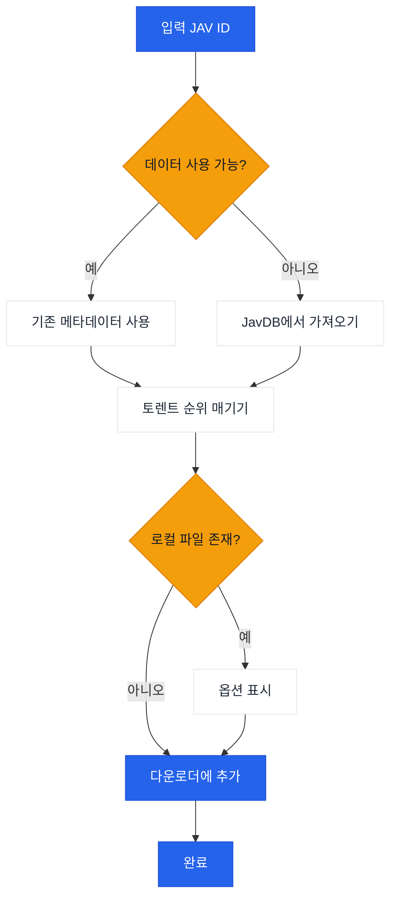

# JavManager

경량 GUI + CLI 도구로 자동화된 JAV 콘텐츠 관리, 빠른 반복 검색, 토렌트 검색, 선택적 qBittorrent 통합 기능을 제공합니다.

[中文](README.zh-CN.md) | [日本語](README.ja.md) | [한국어](README.ko.md)

> **참고:** Everything(로컬 검색)과 qBittorrent(다운로드)는 선택적 통합 기능입니다. JavManager는 이들 없이도 작동합니다(여전히 JavDB를 검색하고 마그넷 링크를 출력할 수 있습니다). HTTP API를 지원하는 다른 도구(예: 다른 검색 엔진이나 다운로드 클라이언트)가 필요하면 [이슈 생성](../../issues/new)을 해주세요.

## 기능

- GUI(Avalonia)와 콘솔 모드(Spectre.Console)
- 다국어 GUI(영어, 중국어, 일본어, 한국어)
- JavDB에서 JAV 메타데이터와 토렌트/마그넷 검색
- Everything 검색 엔진을 통한 로컬 파일 확인
- qBittorrent WebUI API를 통한 다운로드
- 반복 검색을 위한 로컬 JSON 캐시
- 가중치 기반 순위 매기기(마커 + 가중치)를 통한 스마트 토렌트 선택

## 워크플로우



## 외부 종속성

| 서비스 | 필수 | 용도 | 링크 |
|---------|----------|---------|------|
| JavDB | 예 | 메타데이터 & 마그넷 링크 | [javdb.com](https://javdb.com/) |
| Everything | 아니오 (선택적) | 로컬 파일 검색 | [voidtools.com](https://www.voidtools.com/everything-1.5a/) ([HTTP 플러그인](https://www.voidtools.com/forum/viewtopic.php?f=12&t=9799)) |
| qBittorrent | 아니오 (선택적) | 토렌트 다운로드 | [qBittorrent](https://github.com/qbittorrent/qBittorrent) |

### Cloudflare 403 문제

JavDB가 HTTP 403을 반환하면 Cloudflare 챌린지 때문일 가능성이 높습니다. JavManager는 **기본적으로 curl-impersonate를 사용하여 실제 브라우저 TLS/HTTP2 지문을 모방합니다(브라우저 자동화 없음)**. 그래도 403이 표시되면 다른 미러 URL을 시도하거나 IP가 차단되었는지 확인하세요(`doc/CloudflareBypass.md` 참조).

### JavDB 도메인 API

Cloudflare Worker는 공식 사이트에서 최신 JavDB 도메인을 가져오는 API 엔드포인트를 제공합니다:

**엔드포인트:** `GET /api/javdb-domain`

**요청 예시:**
```bash
curl https://your-worker-url/api/javdb-domain
```

**응답 예시:**
```json
{
  "success": true,
  "domains": ["javdb565.com"]
}
```

**오류 응답:**
```json
{
  "success": false,
  "error": "Failed to fetch domain from javdb.com",
  "message": "Could not extract latest domain from javdb.com"
}
```

이 API는 `https://javdb.com/`에서 실시간으로 최신 JavDB 도메인을 가져옵니다. API에는 10초 타임아웃과 적절한 오류 처리가 포함되어 있습니다.

### 원격 분석 + "Jav 트렌드" (선택적)

`Telemetry:Enabled`가 true이면 JavManager는 다음을 게시할 수 있습니다:

- `POST /api/telemetry`에 시작 이벤트
- `POST /api/javinfo`에 JAV 메타데이터(워커 UI에서 사용; 반복 보고는 각 ID 검색 카운터를 증가시킴)

워커는 또한 작은 UI를 제공합니다:

- `/` 개요
- `/jav` "Jav 트렌드"(최근 JavInfo 레코드 + 검색 횟수)

## 설정

설정은 `appsettings.json`(및 선택적 `appsettings.Development.json`)을 통해 구성됩니다.

- 개발: `JavManager/appsettings.json` 편집(이 파일은 `bin/Debug/net10.0/appsettings.json`으로 복사됨).
- 릴리스/단일 파일: 앱은 첫 실행 시 실행 파일 옆에 있는 `appsettings.json`을 읽고(없으면 생성합니다).

설정 참조:

| 섹션 | 키 | 필수 | 기본값 | 설명 |
|---------|-----|----------|---------|-------------|
| Everything | `BaseUrl` | 아니오 (선택적) | _(비어 있음)_ | Everything HTTP 서버 기본 URL(스키마와 호스트 포함). 사용할 수 없으면 로컬 중복 제거가 건너뜁니다. |
| Everything | `UserName` | 아니오 (선택적) | _(비어 있음)_ | 기본 인증 사용자 이름. |
| Everything | `Password` | 아니오 (선택적) | _(비어 있음)_ | 기본 인증 비밀번호. |
| QBittorrent | `BaseUrl` | 아니오 (선택적) | _(비어 있음)_ | qBittorrent WebUI 기본 URL(필요한 경우 포트 포함). 사용할 수 없거나 인증에 실패하면 JavManager는 마그넷 링크를 출력하지만 다운로드 큐에 추가하지 않습니다. |
| QBittorrent | `UserName` | 아니오 (선택적) | _(비어 있음)_ | WebUI 사용자 이름. |
| QBittorrent | `Password` | 아니오 (선택적) | _(비어 있음)_ | WebUI 비밀번호. |
| JavDb | `BaseUrl` | 예 | `https://javdb.com` | 기본 JavDB 기본 URL. |
| JavDb | `MirrorUrls` | 아니오 (선택적) | `[]` | 추가 미러 URL(배열). |
| JavDb | `RequestTimeout` | 아니오 (선택적) | `30000` | 요청 타임아웃(밀리초). |
| JavDb | `UserAgent` | 아니오 (선택적) | _(비어 있음)_ | 사용자 지정 User-Agent 문자열(HttpClient 폴백 모드에서만 사용). |
| JavDb | `CurlImpersonate:Enabled` | 아니오 (선택적) | `true` | JavDB 요청에 curl-impersonate 사용(권장). |
| JavDb | `CurlImpersonate:Target` | 아니오 (선택적) | `chrome116` | `curl_easy_impersonate()`에 사용할 모방 대상 이름(예: `chrome116`). |
| JavDb | `CurlImpersonate:LibraryPath` | 아니오 (선택적) | _(비어 있음)_ | `libcurl.dll`에 대한 선택적 명시적 경로(그렇지 않으면 자동 감지). |
| JavDb | `CurlImpersonate:CaBundlePath` | 아니오 (선택적) | _(비어 있음)_ | `cacert.pem`에 대한 선택적 경로(그렇지 않으면 자동 감지). |
| JavDb | `CurlImpersonate:DefaultHeaders` | 아니오 (선택적) | `true` | curl-impersonate 내장 기본 HTTP 헤더 사용. |
| Download | `DefaultSavePath` | 아니오 (선택적) | _(비어 있음)_ | qBittorrent에 토렌트를 추가할 때 기본 다운로드 경로. |
| Download | `DefaultCategory` | 아니오 (선택적) | `jav` | qBittorrent의 기본 카테고리. |
| Download | `DefaultTags` | 아니오 (선택적) | `jav-manager` | 생성된 다운로드에 대한 기본 태그. |
| LocalCache | `Enabled` | 아니오 (선택적) | `true` | 로컬 캐시 저장소 활성화 또는 비활성화. |
| LocalCache | `DatabasePath` | 아니오 (선택적) | _(비어 있음)_ | JSON 캐시 파일 경로(비어 있으면 기본 `jav_cache.json`이 실행 파일 옆에 사용됨). |
| LocalCache | `CacheExpirationDays` | 아니오 (선택적) | `0` | 캐시 TTL(일, 0은 만료 비활성화). |
| Console | `Language` | 아니오 (선택적) | `en` | UI 언어(`en`, `zh`, 또는 `auto`). |
| Console | `HideOtherTorrents` | 아니오 (선택적) | `true` | 목록에서 일치하지 않는 토렌트 숨기기. |
| Telemetry | `Enabled` | 아니오 (선택적) | `true` | 익명 원격 분석 활성화 또는 비활성화. |
| Telemetry | `Endpoint` | 아니오 (선택적) | `https://jav-manager.techfetch.dev` | 기본 엔드포인트(앱은 `/api/telemetry`와 `/api/javinfo`에 게시함). |
| Update | `Enabled` | 아니오 (선택적) | `true` | 업데이트 확인 활성화 또는 비활성화. |
| Update | `AutoCheckOnStartup` | 아니오 (선택적) | `true` | 시작 시 자동 업데이트 확인(GUI). |
| Update | `GitHubRepo` | 아니오 (선택적) | `jqknono/jav-manager` | 업데이트 확인에 사용되는 GitHub 저장소. |

참고:
- `JavInfoSync:*`는 레거시 섹션 이름입니다. 새 빌드는 `Telemetry:*`를 사용합니다(앱은 하위 호환성을 위해 여전히 레거시 키를 읽습니다).
- 고급: 설정은 또한 `JAVMANAGER_` 접두사가 있는 환경 변수를 지원합니다(중첩 키는 `__`를 사용), 하지만 파일 기반 설정이 기본적으로 지원되는 방법입니다.

## 사용법

```bash
# GUI(인수가 없으면 기본값)
dotnet run --project JavManager/JavManager.csproj

# 콘솔(대화형)
dotnet run --project JavManager/JavManager.csproj -- --no-gui

# 콘솔(비대화형)
dotnet run --project JavManager/JavManager.csproj -- STARS-001

# 도움말 표시
dotnet run --project JavManager/JavManager.csproj -- help

# 버전 표시
dotnet run --project JavManager/JavManager.csproj -- version
```

콘솔 명령의 경우 `dotnet run --project JavManager/JavManager.csproj -- help`를 실행하세요.

## 빌드 & 패키징

```bash
# 빌드
dotnet build JavManager/JavManager.csproj

# 테스트 실행
dotnet test JavManager.Tests/JavManager.Tests.csproj

# 게시(다중 RID, 자체 포함, 출력은 artifacts/publish/<rid>/)
pwsh scripts/publish.ps1

# PATH에 설치(Windows)
pwsh scripts/install-windows.ps1 -AddToPath
```

### Android(실험적)

Android 빌드는 선택적입니다(데스크톱 빌드가 Android 워크로드를 필요로 하지 않도록 함).

```bash
# 워크로드 설치(한 번)
dotnet workload install android

# Android 대상 빌드(Android SDK/JDK 구성 필요)
dotnet build JavManager/JavManager.csproj -c Debug -f net10.0-android -p:EnableAndroid=true
```