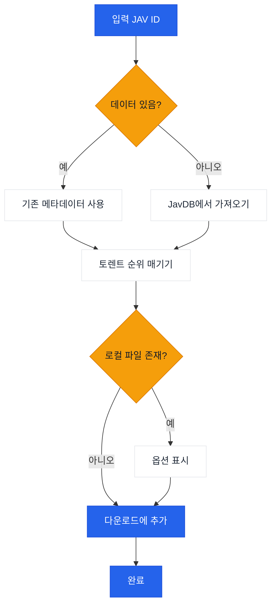

# JavManager

JAV 콘텐츠 관리를 자동화하는 커맨드라인 도구로, 빠른 반복 검색, 토렌트 검색 및 qBittorrent 통합을 지원합니다.

[中文](README.zh-CN.md) | [日本語](README.ja.md) | [한국어](README.ko.md)

> **참고:** 현재 Everything(로컬 검색)과 qBittorrent(다운로드)를 지원합니다. HTTP API를 제공하는 다른 도구(예: 다른 검색 엔진 또는 다운로드 클라이언트)에 대한 지원이 필요한 경우 [이슈를 생성해 주세요](../../issues/new).

## 기능

- JavDB에서 JAV 메타데이터 및 마그넷 링크 검색
- 빠른 검색
- Everything 검색 엔진을 통한 로컬 파일 확인
- qBittorrent WebUI API를 통한 다운로드
- 가중치 기반 순위 시스템을 통한 스마트 토렌트 선택

## 작업 흐름



## 외부 종속성

| 서비스 | 목적 | 링크 |
|---------|---------|------|
| Everything | 로컬 파일 검색 | [voidtools.com](https://www.voidtools.com/everything-1.5a/) ([HTTP 플러그인](https://www.voidtools.com/forum/viewtopic.php?f=12&t=9799)) |
| JavDB | 메타데이터 및 마그넷 링크 | [javdb.com](https://javdb.com/) |
| qBittorrent | 토렌트 다운로드 | [qBittorrent](https://github.com/qbittorrent/qBittorrent) |

### Cloudflare 403 문제

JavDB에서 HTTP 403을 반환하는 경우, 대부분 Cloudflare 챌린지 때문입니다. JavManager는 내장된 Chrome 유사 헤더를 사용하며 서드파티 도구 없이 재시도합니다. 그래도 403이 발생하면 브라우저에서 `cf_clearance`와 일치하는 `UserAgent`를 구성하세요 (자세한 내용은 `doc/CloudflareBypass.md` 참조).

## 구성

모든 설정은 `JavManager/appsettings.json`에서 구성됩니다 (로컬 재정의에는 `appsettings.Development.json` 사용). 환경 변수 재정의는 지원되지 않습니다.

### Everything

- `BaseUrl`: Everything HTTP 서버 기본 URL (스키마와 호스트 포함).
- `UserName`: 선택적 기본 인증 사용자 이름.
- `Password`: 선택적 기본 인증 비밀번호.

### QBittorrent

- `BaseUrl`: qBittorrent WebUI 기본 URL (필요한 경우 포트 포함).
- `UserName`: WebUI 사용자 이름.
- `Password`: WebUI 비밀번호.

### JavDb

- `BaseUrl`: 기본 JavDB 기본 URL.
- `MirrorUrls`: 추가 미러 URL (배열).
- `RequestTimeout`: 요청 시간 제한 (밀리초).
- `CfClearance`: `cf_clearance` 쿠키 값.
- `CfBm`: `__cf_bm` 쿠키 값 (선택 사항).
- `UserAgent`: 쿠키 소스와 일치하는 브라우저 User-Agent 문자열.

### 다운로드

- `DefaultSavePath`: 토렌트 기본 저장 경로.
- `DefaultCategory`: qBittorrent에서 기본 카테고리/태그.
- `DefaultTags`: 생성된 다운로드에 대한 기본 태그.

### 로컬 캐시

- `Enabled`: 로컬 캐시 저장소 활성화 또는 비활성화.
- `DatabasePath`: 사용자 정의 데이터베이스 경로 (기본값 사용 시 비워둠).
- `CacheExpirationDays`: 캐시 TTL (일 단위, 0은 만료 비활성화).

### 콘솔

- `Language`: UI 언어 (`en` 또는 `zh`).
- `HideOtherTorrents`: 목록에서 일치하지 않는 토렌트 숨기기.

### 원격 측정

- `Enabled`: 익명 원격 측정 활성화 또는 비활성화.
- `Endpoint`: 원격 측정 엔드포인트 URL.

### JavInfo 동기화

- `Enabled`: JavInfo 동기화 활성화 또는 비활성화.
- `Endpoint`: JavInfo 동기화 엔드포인트 URL.
- `ApiKey`: 선택적 API 키 (엔드포인트가 필요한 경우).

## 사용법

```bash
# 대화형 모드
dotnet run --project JavManager/JavManager.csproj

# 직접 검색
dotnet run --project JavManager/JavManager.csproj -- STARS-001

# 도움말 표시
dotnet run --project JavManager/JavManager.csproj -- help

# 버전 표시
dotnet run --project JavManager/JavManager.csproj -- version
```

**대화형 명령어:**

| 명령어 | 설명 |
|---------|-------------|
| `<code>` | JAV 코드로 검색 (예: `STARS-001`) |
| `r <code>` | 검색 새로고침 |
| `c` | 저장된 데이터 통계 표시 |
| `h` | 도움말 표시 |
| `q` | 종료 |

## 빌드 & 패키징

```bash
# 빌드
dotnet build JavManager/JavManager.csproj

# 테스트 실행
dotnet test JavManager.Tests/JavManager.Tests.csproj

# 패키징 (Windows 독립 실행형 zip)
pwsh scripts/package.ps1

# PATH에 설치 (Windows)
pwsh scripts/install-windows.ps1 -AddToPath
```