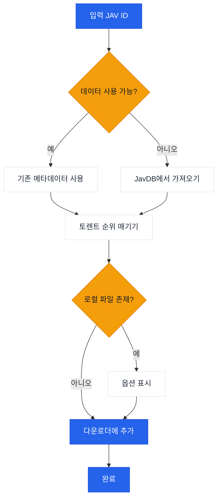

# JavManager

자동화된 JAV 콘텐츠 관리를 위한 명령줄 도구로, 빠른 반복 검색, 토렌트 검색, qBittorrent 통합 기능을 제공합니다.

[中文](README.zh-CN.md) | [日本語](README.ja.md) | [한국어](README.ko.md)

> **참고:** Everything(로컬 검색)과 qBittorrent(다운로드)는 선택적 통합입니다. JavManager는 이들 없이도 작동합니다(여전히 JavDB를 검색하고 마그넷 링크를 출력할 수 있습니다). 다른 HTTP API를 지원하는 도구(예: 다른 검색 엔진이나 다운로드 클라이언트)가 필요한 경우 [이슈를 생성](../../issues/new)하세요.

## 기능

- JavDB에서 JAV 메타데이터 및 마그넷 링크 검색
- 빠른 검색
- Everything 검색 엔진을 통한 로컬 파일 확인
- qBittorrent WebUI API를 통한 다운로드
- 가중치 기반 순위 매김을 통한 스마트 토렌트 선택

## 워크플로우



## 외부 종속성

| 서비스 | 필수 | 용도 | 링크 |
|---------|----------|---------|------|
| JavDB | 예 | 메타데이터 및 마그넷 링크 | [javdb.com](https://javdb.com/) |
| Everything | 아니오(선택사항) | 로컬 파일 검색 | [voidtools.com](https://www.voidtools.com/everything-1.5a/) ([HTTP 플러그인](https://www.voidtools.com/forum/viewtopic.php?f=12&t=9799)) |
| qBittorrent | 아니오(선택사항) | 토렌트 다운로드 | [qBittorrent](https://github.com/qbittorrent/qBittorrent) |

### Cloudflare 403 문제

JavDB가 HTTP 403을 반환하면 Cloudflare 챌린지 때문일 가능성이 높습니다. JavManager는 기본적으로 **curl-impersonate를 사용하여** 실제 브라우저 TLS/HTTP2 지문을 모방합니다(브라우저 자동화 없음). 그래도 403이 표시되면 다른 미러 URL을 시도하거나 IP가 차단되었는지 확인하세요(자세한 내용은 `doc/CloudflareBypass.md` 참조).

## 설정

모든 설정은 `JavManager/appsettings.json`에서 구성됩니다(로컬 재정의용으로 `appsettings.Development.json` 사용 가능). 환경 변수 재정의는 지원되지 않습니다.

설정 참조:

| 섹션 | 키 | 필수 | 기본값 | 설명 |
|---------|-----|----------|---------|-------------|
| Everything | `BaseUrl` | 아니오(선택사항) | `http://localhost` | Everything HTTP 서버 기본 URL(스키마와 호스트 포함). 사용할 수 없으면 로컬 중복 제거가 건너뜁니다. |
| Everything | `UserName` | 아니오(선택사항) | _(비어 있음)_ | 기본 인증 사용자 이름. |
| Everything | `Password` | 아니오(선택사항) | _(비어 있음)_ | 기본 인증 비밀번호. |
| QBittorrent | `BaseUrl` | 아니오(선택사항) | `http://localhost:8080` | qBittorrent WebUI 기본 URL(필요한 경우 포트 포함). 사용할 수 없거나 인증이 실패하면 JavManager는 마그넷 링크를 출력하지만 다운로드 큐에 추가하지 않습니다. |
| QBittorrent | `UserName` | 아니오(선택사항) | `admin` | WebUI 사용자 이름. |
| QBittorrent | `Password` | 아니오(선택사항) | _(비어 있음)_ | WebUI 비밀번호. |
| JavDb | `BaseUrl` | 예 | `https://javdb.com` | 기본 JavDB 기본 URL. |
| JavDb | `MirrorUrls` | 아니오(선택사항) | `[]` | 추가 미러 URL(배열). |
| JavDb | `RequestTimeout` | 아니오(선택사항) | `30000` | 요청 제한 시간(밀리초). |
| JavDb | `UserAgent` | 아니오(선택사항) | _(비어 있음)_ | 사용자 지정 User-Agent 문자열(HttpClient 폴백 모드에서만 사용). |
| JavDb | `CurlImpersonate:Enabled` | 아니오(선택사항) | `true` | JavDB 요청에 curl-impersonate 사용(권장). |
| JavDb | `CurlImpersonate:Target` | 아니오(선택사항) | `chrome116` | `curl_easy_impersonate()`에 사용할 모방 대상 이름(예: `chrome116`). |
| JavDb | `CurlImpersonate:LibraryPath` | 아니오(선택사항) | _(비어 있음)_ | `libcurl.dll`에 대한 선택적 명시적 경로(그렇지 않으면 자동 감지). |
| JavDb | `CurlImpersonate:CaBundlePath` | 아니오(선택사항) | _(비어 있음)_ | `cacert.pem`에 대한 선택적 경로(그렇지 않으면 자동 감지). |
| JavDb | `CurlImpersonate:DefaultHeaders` | 아니오(선택사항) | `true` | curl-impersonate 기본 HTTP 헤더 사용. |
| Download | `DefaultSavePath` | 아니오(선택사항) | _(비어 있음)_ | qBittorrent에 토렌트를 추가할 때 기본 다운로드 경로. |
| Download | `DefaultCategory` | 아니오(선택사항) | `jav` | qBittorrent의 기본 카테고리. |
| Download | `DefaultTags` | 아니오(선택사항) | `auto-download` | 생성된 다운로드에 대한 기본 태그. |
| LocalCache | `Enabled` | 아니오(선택사항) | `true` | 로컬 캐시 저장소 사용 여부 설정. |
| LocalCache | `DatabasePath` | 아니오(선택사항) | _(비어 있음)_ | JSON 캐시 파일 경로(비워두면 실행 파일 옆의 기본 `jav_cache.json` 사용). |
| LocalCache | `CacheExpirationDays` | 아니오(선택사항) | `0` | 캐시 TTL(일, 0은 만료 비활성화). |
| Console | `Language` | 아니오(선택사항) | `en` | UI 언어(`en`, `zh`, 또는 `auto`). |
| Console | `HideOtherTorrents` | 아니오(선택사항) | `true` | 목록에서 일치하지 않는 토렌트 숨기기. |
| Telemetry | `Enabled` | 아니오(선택사항) | `true` | 익명 원격 분석 사용 여부 설정. |
| Telemetry | `Endpoint` | 아니오(선택사항) | _(비어 있음)_ | 원격 분석 엔드포인트 URL(비워두면 기본값 사용). |
| JavInfoSync | `Enabled` | 아니오(선택사항) | `false` | JavInfo 동기화 사용 여부 설정. |
| JavInfoSync | `Endpoint` | 활성화된 경우 | _(비어 있음)_ | JavInfo 동기화 엔드포인트 URL. |
| JavInfoSync | `ApiKey` | 아니오(선택사항) | _(비어 있음)_ | 선택적 API 키(`X-API-Key`로 전송). |

## 사용법

```bash
# 대화형 모드
dotnet run --project JavManager/JavManager.csproj

# 직접 검색
dotnet run --project JavManager/JavManager.csproj -- STARS-001

# 도움말 표시
dotnet run --project JavManager/JavManager.csproj -- help

# 버전 표시
dotnet run --project JavManager/JavManager.csproj -- version
```

**대화형 명령어:**

| 명령어 | 설명 |
|---------|-------------|
| `<코드>` | JAV 코드로 검색(예: `STARS-001`) |
| `r <코드>` | 검색 새로고침 |
| `c` | 저장된 데이터 통계 표시 |
| `h` | 도움말 표시 |
| `q` | 종료 |

## 빌드 및 패키징

```bash
# 빌드
dotnet build JavManager/JavManager.csproj

# 테스트 실행
dotnet test JavManager.Tests/JavManager.Tests.csproj

# 패키징(Windows 독립 실행형 zip)
pwsh scripts/package.ps1

# 경로에 설치(Windows)
pwsh scripts/install-windows.ps1 -AddToPath
```