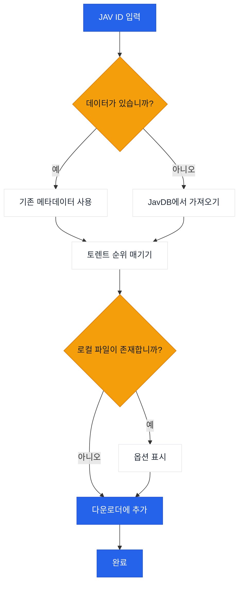

# JavManager

반복 검색, 토렌트 검색 및 선택적 qBittorrent 통합 기능을 갖춘 JAV 콘텐츠 관리 자동화를 위한 가벼운 GUI + CLI 도구입니다.

[繁體中文](README.zh-TW.md) | [日本語](README.ja.md) | [한국어](README.ko.md)

## 사용법

```bash
# GUI
npx jav-manager --gui

# CLI (대화형)
npx jav-manager

# CLI (비대화형)
npx jav-manager STARS-001

# 도움말 / 버전
npx jav-manager help
npx jav-manager version
```

참고:
- Everything (로컬 검색)과 qBittorrent (다운로드)는 선택적 통합 기능입니다. JavManager는 이들이 없어도 작동하며 (JavDB 검색 및 마그넷 링크 출력 가능).
- 전역으로 설치한 경우(`npm install -g jav-manager`) `npx jav-manager`를 `jav-manager`로 대체하세요.
- HTTP API를 사용하는 다른 도구(예: 다른 검색 엔진이나 다운로드 클라이언트)에 대한 지원이 필요한 경우, [이슈를 생성](../../issues/new)해 주세요.

## 기능

- GUI (로컬 웹 UI) 및 콘솔 모드 (Node.js)
- 다국어 UI (영어, 중국어, 일본어, 한국어)
- JavDB에서 JAV 메타데이터 및 토렌트/마그넷 검색
- Everything 검색 엔진을 통한 로컬 파일 확인
- qBittorrent WebUI API를 통한 다운로드
- 반복 검색을 위한 로컬 JSON 캐시
- 가중치 기반 순위(마커 + 가중치)를 통한 스마트 토렌트 선택

## 워크플로우



## 외부 종속성

| 서비스 | 필수 | 용도 | 링크 |
|---------|----------|---------|------|
| JavDB | 예 | 메타데이터 및 마그넷 링크 | [javdb.com](https://javdb.com/) |
| Everything | 아니오 (선택) | 로컬 파일 검색 | [voidtools.com](https://www.voidtools.com/everything-1.5a/) ([HTTP 플러그인](https://www.voidtools.com/forum/viewtopic.php?f=12&t=9799)) |
| qBittorrent | 아니오 (선택) | 토렌트 다운로드 | [qBittorrent](https://github.com/qbittorrent/qBittorrent) |

### Cloudflare 403 문제

JavDB가 HTTP 403을 반환하는 경우 Cloudflare 챌린지 때문일 가능성이 높습니다. JavManager는 실제 브라우저 TLS/HTTP2 지문을 모방하기 위해 **기본적으로 curl-impersonate를 사용**합니다 (브라우저 자동화 없음). 여전히 403이 표시되면 다른 미러 URL을 시도하거나 IP가 차단되었는지 확인하세요 (`doc/CloudflareBypass.md` 참조).

### JavDB 도메인 API

Cloudflare Worker는 공식 사이트에서 최신 JavDB 도메인을 가져오는 API 엔드포인트를 제공합니다:

**엔드포인트:** `GET /api/javdb-domain`

**요청 예시:**
```bash
curl https://your-worker-url/api/javdb-domain
```

**응답 예시:**
```json
{
  "success": true,
  "domains": ["javdb565.com"]
}
```

**오류 응답:**
```json
{
  "success": false,
  "error": "Failed to fetch domain from javdb.com",
  "message": "Could not extract latest domain from javdb.com"
}
```

이 API는 실시간으로 `https://javdb.com/`에서 최신 JavDB 도메인을 가져옵니다. 이 API는 10초 타임아웃 및 적절한 오류 처리를 포함합니다.

### 원격 측정 + "Jav Trends" (선택 사항)

`Telemetry:Enabled`가 true인 경우, JavManager는 다음을 게시할 수 있습니다:

- `POST /api/telemetry`로 시작 이벤트 전송
- `POST /api/javinfo`로 JAV 메타데이터 전송 (워커 UI에서 사용; 반복 보고는 ID별 검색 횟수를 증가시킴)

워커는 작은 UI도 제공합니다:

- `/` 개요
- `/jav` "Jav Trends" (최근 JavInfo 기록 + 검색 횟수)

## 설정

설정은 `appsettings.json`(및 선택적 `appsettings.Development.json`)을 통해 구성됩니다.

설정 파일 위치:
- `JAVMANAGER_CONFIG_DIR`이 설정되어 있고 존재하는 경우, 해당 위치에서 설정을 읽습니다.
- 그렇지 않으면 JavManager는 실행 파일 디렉토리에서 먼저 `appsettings.json`을 찾은 다음 현재 작업 디렉토리를 찾습니다.
- GUI "설정" 및 CLI `cfg set ...`은 선택한 설정 디렉토리에 `appsettings.json`을 씁니다 (위의 조회 규칙 참조).

설정 참조:

| 섹션 | 키 | 필수 | 기본값 | 설명 |
|---------|-----|----------|---------|-------------|
| Everything | `BaseUrl` | 아니오 (선택) | _(비어 있음)_ | Everything HTTP 서버 기본 URL (스킴 및 호스트 포함). 사용할 수 없는 경우 로컬 중복 제거가 건너뜁니다. |
| Everything | `UserName` | 아니오 (선택) | _(비어 있음)_ | 기본 인증 사용자 이름. |
| Everything | `Password` | 아니오 (선택) | _(비어 있음)_ | 기본 인증 비밀번호. |
| QBittorrent | `BaseUrl` | 아니오 (선택) | _(비어 있음)_ | qBittorrent WebUI 기본 URL (필요한 경우 포트 포함). 사용할 수 없거나 인증 실패 시, JavManager는 다운로드 대기열에 추가하지 않고 마그넷 링크를 출력합니다. |
| QBittorrent | `UserName` | 아니오 (선택) | _(비어 있음)_ | WebUI 사용자 이름. |
| QBittorrent | `Password` | 아니오 (선택) | _(비어 있음)_ | WebUI 비밀번호. |
| JavDb | `BaseUrl` | 예 | `https://javdb.com` | 기본 JavDB 기본 URL. |
| JavDb | `MirrorUrls` | 아니오 (선택) | `[]` | 추가 미러 URL (배열). |
| JavDb | `RequestTimeout` | 아니오 (선택) | `30000` | 요청 타임아웃 (밀리초). |
| JavDb | `UserAgent` | 아니오 (선택) | _(비어 있음)_ | 사용자 정의 User-Agent 문자열 (HttpClient 폴백 모드에서만 사용). |
| JavDb | `CurlImpersonate:Enabled` | 아니오 (선택) | `true` | JavDB 요청에 curl-impersonate 활성화 (권장). |
| JavDb | `CurlImpersonate:Target` | 아니오 (선택) | `chrome116` | `curl_easy_impersonate()`에 대한 가장 대상 이름 (예: `chrome116`). |
| JavDb | `CurlImpersonate:LibraryPath` | 아니오 (선택) | _(비어 있음)_ | `libcurl.dll`에 대한 선택적 명시적 경로 (그렇지 않으면 자동 감지). |
| JavDb | `CurlImpersonate:CaBundlePath` | 아니오 (선택) | _(비어 있음)_ | `cacert.pem`에 대한 선택적 경로 (그렇지 않으면 자동 감지). |
| JavDb | `CurlImpersonate:DefaultHeaders` | 아니오 (선택) | `true` | curl-impersonate 기본 제공 기본 HTTP 헤더 사용. |
| Download | `DefaultSavePath` | 아니오 (선택) | _(비어 있음)_ | qBittorrent에 토렌트를 추가할 때 기본 다운로드 경로. |
| Download | `DefaultCategory` | 아니오 (선택) | `jav` | qBittorrent의 기본 카테고리. |
| Download | `DefaultTags` | 아니오 (선택) | `jav-manager` | 생성된 다운로드의 기본 태그. |
| LocalCache | `Enabled` | 아니오 (선택) | `true` | 로컬 캐시 저장소 활성화 또는 비활성화. |
| LocalCache | `DatabasePath` | 아니오 (선택) | _(비어 있음)_ | JSON 캐시 파일 경로 (기본값인 실행 파일 옆의 `jav_cache.json`을 사용하려면 비워 둡니다). |
| LocalCache | `CacheExpirationDays` | 아니오 (선택) | `0` | 캐시 TTL (일) (0은 만료 비활성화). |
| Console | `Language` | 아니오 (선택) | `en` | UI 언어 (`en` 또는 `zh`). |
| Console | `HideOtherTorrents` | 아니오 (선택) | `true` | 목록에서 일치하지 않는 토렌트 숨기기. |
| Telemetry | `Enabled` | 아니오 (선택) | `true` | 익명 원격 측정 활성화 또는 비활성화. |
| Telemetry | `Endpoint` | 아니오 (선택) | `https://jav-manager.techfetch.dev` | 기본 엔드포인트 (앱이 `/api/telemetry` 및 `/api/javinfo`에 게시). |
| Update | `Enabled` | 아니오 (선택) | `true` | 업데이트 확인 활성화 또는 비활성화. |
| Update | `AutoCheckOnStartup` | 아니오 (선택) | `true` | 시작 시 업데이트 자동 확인 (GUI). |
| Update | `GitHubRepo` | 아니오 (선택) | `jqknono/jav-manager` | 업데이트 확인에 사용되는 GitHub 저장소. |

참고:
- `JavInfoSync:*`는 레거시 섹션 이름입니다. 최신 빌드는 `Telemetry:*`를 사용합니다 (앱은 이전 버전과의 호환성을 위해 레거시 키를 계속 읽습니다).
- 고급: 구성은 `JAVMANAGER_` 접두사가 있는 환경 변수도 지원하지만(중첩 키는 `__` 사용), 파일 기반 구성이 기본 지원되는 방법입니다.

## 개발

```bash
# 의존성 설치
npm install

# 빌드
npm run build

# 실행 (GUI / CLI)
npm run gui
npm run cli

# 실행 (컴파일된 기본 진입점)
npm run start

# 테스트
npm test
```