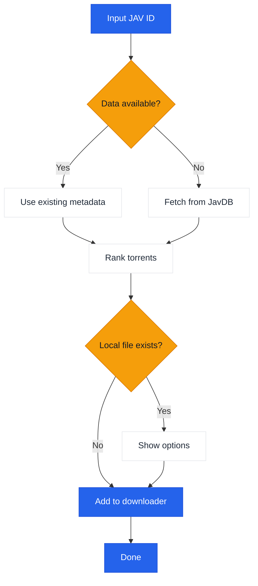

# JavManager

A command-line tool for automated JAV content management with fast repeat searches, torrent search, and qBittorrent integration.

[中文](README.zh-CN.md) | [日本語](README.ja.md) | [한국어](README.ko.md)

> **Note:** Currently supports Everything (local search) and qBittorrent (download). If you need support for other tools with HTTP API (e.g., other search engines or download clients), please [create an issue](../../issues/new).

## Features

- Search JAV metadata and magnet links from JavDB
- Fast searches
- Check local files via Everything search engine
- Download via qBittorrent WebUI API
- Smart torrent selection with weight-based ranking

## Workflow



## External Dependencies

| Service | Purpose | Link |
|---------|---------|------|
| Everything | Local file search | [voidtools.com](https://www.voidtools.com/everything-1.5a/) ([HTTP plugin](https://www.voidtools.com/forum/viewtopic.php?f=12&t=9799)) |
| JavDB | Metadata & magnet links | [javdb.com](https://javdb.com/) |
| qBittorrent | Torrent download | [qBittorrent](https://github.com/qbittorrent/qBittorrent) |

### Cloudflare 403 Issue

If JavDB returns HTTP 403, it's likely due to a Cloudflare challenge. JavManager uses built-in Chrome-like headers and retries without third-party tools. If you still see 403, configure `cf_clearance` and a matching `UserAgent` from your browser (see `doc/CloudflareBypass.md`).

## Configuration

All settings are configured in `JavManager/appsettings.json` (use `appsettings.Development.json` for local overrides). Environment variable overrides are not supported.

### Everything

- `BaseUrl`: Everything HTTP server base URL (include scheme and host).
- `UserName`: Optional basic auth user name.
- `Password`: Optional basic auth password.

### QBittorrent

- `BaseUrl`: qBittorrent WebUI base URL (include port if needed).
- `UserName`: WebUI user name.
- `Password`: WebUI password.

### JavDb

- `BaseUrl`: Primary JavDB base URL.
- `MirrorUrls`: Additional mirror URLs (array).
- `RequestTimeout`: Request timeout in milliseconds.
- `CfClearance`: `cf_clearance` cookie value.
- `CfBm`: `__cf_bm` cookie value (optional).
- `UserAgent`: Browser User-Agent string matching the cookie source.

### Download

- `DefaultSavePath`: Default download path for torrents.
- `DefaultCategory`: Default category/tag in qBittorrent.
- `DefaultTags`: Default tags for created downloads.

### LocalCache

- `Enabled`: Enable or disable local cache storage.
- `DatabasePath`: Custom database path (leave empty for default).
- `CacheExpirationDays`: Cache TTL in days (0 disables expiration).

### Console

- `Language`: UI language (`en` or `zh`).
- `HideOtherTorrents`: Hide non-matching torrents in the list.

### Telemetry

- `Enabled`: Enable or disable anonymous telemetry.
- `Endpoint`: Telemetry endpoint URL.

### JavInfoSync

- `Enabled`: Enable or disable JavInfo sync.
- `Endpoint`: JavInfo sync endpoint URL.
- `ApiKey`: Optional API key (if the endpoint requires it).

## Usage

```bash
# Interactive mode
dotnet run --project JavManager/JavManager.csproj

# Direct search
dotnet run --project JavManager/JavManager.csproj -- STARS-001

# Show help
dotnet run --project JavManager/JavManager.csproj -- help

# Show version
dotnet run --project JavManager/JavManager.csproj -- version
```

**Interactive Commands:**

| Command | Description |
|---------|-------------|
| `<code>` | Search by JAV code (e.g., `STARS-001`) |
| `r <code>` | Refresh search|
| `c` | Show saved data statistics |
| `h` | Show help |
| `q` | Quit |

## Build & Package

```bash
# Build
dotnet build JavManager/JavManager.csproj

# Run tests
dotnet test JavManager.Tests/JavManager.Tests.csproj

# Package (Windows standalone zip)
pwsh scripts/package.ps1

# Install to PATH (Windows)
pwsh scripts/install-windows.ps1 -AddToPath
```
