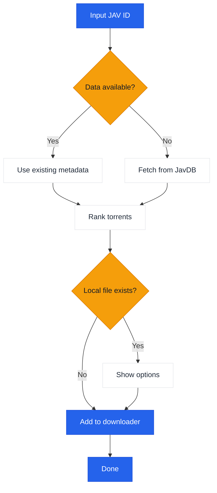

# JavManager

A command-line tool for automated JAV content management with fast repeat searches, torrent search, and qBittorrent integration.

[中文](README.zh-CN.md) | [日本語](README.ja.md) | [한국어](README.ko.md)

> **Note:** Everything (local search) and qBittorrent (download) are optional integrations. JavManager works without them (it can still search JavDB and output magnet links). If you need support for other tools with HTTP API (e.g., other search engines or download clients), please [create an issue](../../issues/new).

## Features

- Search JAV metadata and magnet links from JavDB
- Fast searches
- Check local files via Everything search engine
- Download via qBittorrent WebUI API
- Smart torrent selection with weight-based ranking

## Workflow



## External Dependencies

| Service | Required | Purpose | Link |
|---------|----------|---------|------|
| JavDB | Yes | Metadata & magnet links | [javdb.com](https://javdb.com/) |
| Everything | No (optional) | Local file search | [voidtools.com](https://www.voidtools.com/everything-1.5a/) ([HTTP plugin](https://www.voidtools.com/forum/viewtopic.php?f=12&t=9799)) |
| qBittorrent | No (optional) | Torrent download | [qBittorrent](https://github.com/qbittorrent/qBittorrent) |

### Cloudflare 403 Issue

If JavDB returns HTTP 403, it's likely due to a Cloudflare challenge. JavManager uses **curl-impersonate by default** to mimic a real browser TLS/HTTP2 fingerprint (no browser automation). If you still see 403, try a different mirror URL or check if your IP is blocked (see `doc/CloudflareBypass.md`).

## Configuration

All settings are configured in `JavManager/appsettings.json` (use `appsettings.Development.json` for local overrides). Environment variable overrides are not supported.

Configuration reference:

| Section | Key | Required | Default | Description |
|---------|-----|----------|---------|-------------|
| Everything | `BaseUrl` | No (optional) | `http://localhost` | Everything HTTP server base URL (include scheme and host). If unavailable, local dedup is skipped. |
| Everything | `UserName` | No (optional) | _(empty)_ | Basic auth user name. |
| Everything | `Password` | No (optional) | _(empty)_ | Basic auth password. |
| QBittorrent | `BaseUrl` | No (optional) | `http://localhost:8080` | qBittorrent WebUI base URL (include port if needed). If unavailable/auth fails, JavManager prints magnet links without adding to download queue. |
| QBittorrent | `UserName` | No (optional) | `admin` | WebUI user name. |
| QBittorrent | `Password` | No (optional) | _(empty)_ | WebUI password. |
| JavDb | `BaseUrl` | Yes | `https://javdb.com` | Primary JavDB base URL. |
| JavDb | `MirrorUrls` | No (optional) | `[]` | Additional mirror URLs (array). |
| JavDb | `RequestTimeout` | No (optional) | `30000` | Request timeout in milliseconds. |
| JavDb | `UserAgent` | No (optional) | _(empty)_ | Custom User-Agent string (used only in HttpClient fallback mode). |
| JavDb | `CurlImpersonate:Enabled` | No (optional) | `true` | Enable curl-impersonate for JavDB requests (recommended). |
| JavDb | `CurlImpersonate:Target` | No (optional) | `chrome116` | Impersonation target name for `curl_easy_impersonate()` (e.g. `chrome116`). |
| JavDb | `CurlImpersonate:LibraryPath` | No (optional) | _(empty)_ | Optional explicit path to `libcurl.dll` (otherwise auto-detected). |
| JavDb | `CurlImpersonate:CaBundlePath` | No (optional) | _(empty)_ | Optional path to `cacert.pem` (otherwise auto-detected). |
| JavDb | `CurlImpersonate:DefaultHeaders` | No (optional) | `true` | Use curl-impersonate built-in default HTTP headers. |
| Download | `DefaultSavePath` | No (optional) | _(empty)_ | Default download path when adding torrents to qBittorrent. |
| Download | `DefaultCategory` | No (optional) | `jav` | Default category in qBittorrent. |
| Download | `DefaultTags` | No (optional) | `auto-download` | Default tags for created downloads. |
| LocalCache | `Enabled` | No (optional) | `true` | Enable or disable local cache storage. |
| LocalCache | `DatabasePath` | No (optional) | _(empty)_ | JSON cache file path (leave empty for default `jav_cache.json` next to the executable). |
| LocalCache | `CacheExpirationDays` | No (optional) | `0` | Cache TTL in days (0 disables expiration). |
| Console | `Language` | No (optional) | `en` | UI language (`en`, `zh`, or `auto`). |
| Console | `HideOtherTorrents` | No (optional) | `true` | Hide non-matching torrents in the list. |
| Telemetry | `Enabled` | No (optional) | `true` | Enable or disable anonymous telemetry. |
| Telemetry | `Endpoint` | No (optional) | _(empty)_ | Telemetry endpoint URL (leave empty to use the default). |
| JavInfoSync | `Enabled` | No (optional) | `false` | Enable or disable JavInfo sync. |
| JavInfoSync | `Endpoint` | If enabled | _(empty)_ | JavInfo sync endpoint URL. |
| JavInfoSync | `ApiKey` | No (optional) | _(empty)_ | Optional API key (sent via `X-API-Key`). |

## Usage

```bash
# Interactive mode
dotnet run --project JavManager/JavManager.csproj

# Direct search
dotnet run --project JavManager/JavManager.csproj -- STARS-001

# Show help
dotnet run --project JavManager/JavManager.csproj -- help

# Show version
dotnet run --project JavManager/JavManager.csproj -- version
```

**Interactive Commands:**

| Command | Description |
|---------|-------------|
| `<code>` | Search by JAV code (e.g., `STARS-001`) |
| `r <code>` | Refresh search|
| `c` | Show saved data statistics |
| `h` | Show help |
| `q` | Quit |

## Build & Package

```bash
# Build
dotnet build JavManager/JavManager.csproj

# Run tests
dotnet test JavManager.Tests/JavManager.Tests.csproj

# Package (Windows standalone zip)
pwsh scripts/package.ps1

# Install to PATH (Windows)
pwsh scripts/install-windows.ps1 -AddToPath
```
