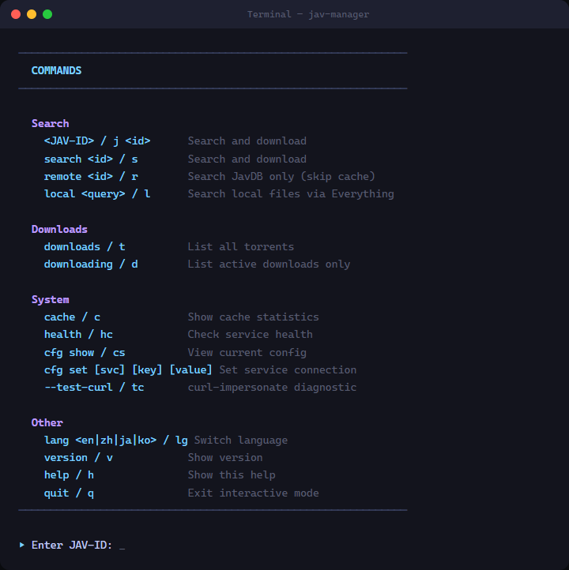
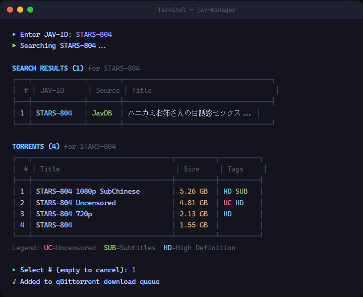
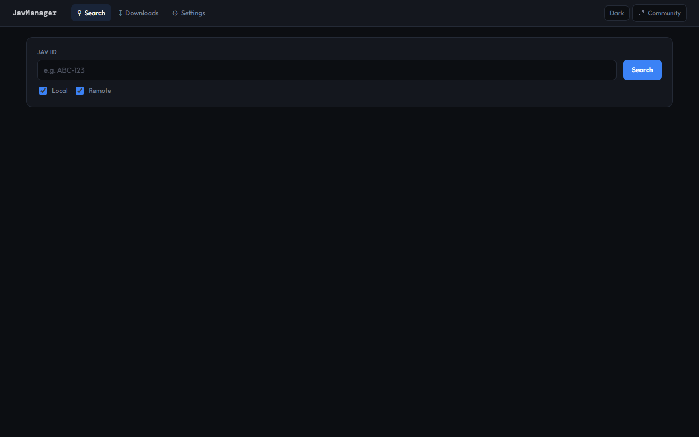
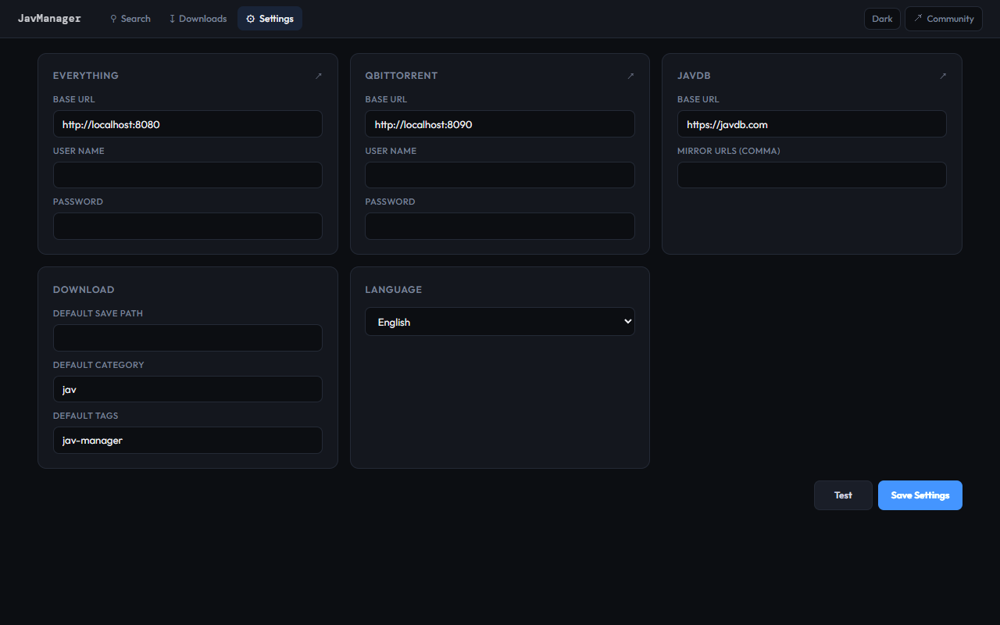
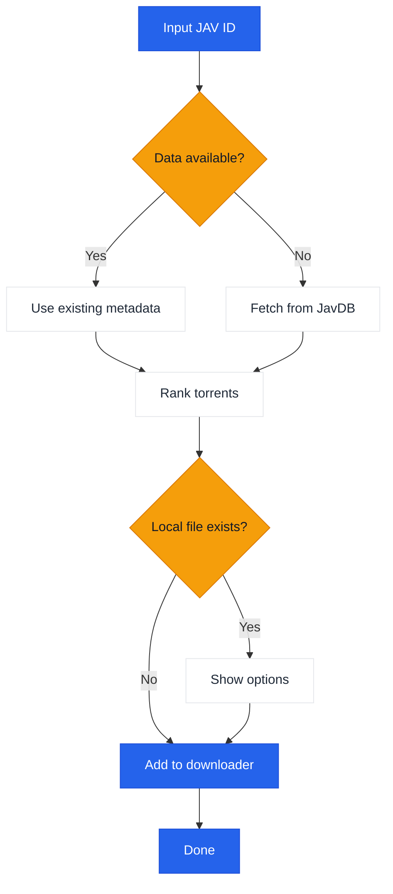

# JavManager

A lightweight GUI + CLI tool for automated JAV content management with fast repeat searches, torrent search, and optional qBittorrent integration.

[繁體中文](README.zh-TW.md) | [日本語](README.ja.md) | [한국어](README.ko.md)

## Usage

```bash
# GUI
npx jav-manager --gui

# CLI (interactive)
npx jav-manager

# CLI (non-interactive)
npx jav-manager STARS-001

# Help / version
npx jav-manager help
npx jav-manager version
```

Notes:
- Everything (local search) and qBittorrent (download) are optional integrations. JavManager works without them (it can still search JavDB and output magnet links).
- Replace `npx jav-manager` with `jav-manager` if you installed it globally (`npm install -g jav-manager`).
- If you need support for other tools with HTTP APIs (e.g., other search engines or download clients), please [create an issue](../../issues/new).

## Features

- GUI (local web UI) and console mode (Node.js)
- Multilingual UI (English, Chinese, Japanese, Korean)
- Search JAV metadata and torrents/magnets from JavDB
- Check local files via Everything search engine
- Download via qBittorrent WebUI API
- Local JSON cache for repeat searches
- Smart torrent selection with weight-based ranking (markers + weights)

## Screenshots

### CLI

<p align="center">
  
</p>

<p align="center"><em>Interactive CLI — available commands and keyboard shortcuts</em></p>

<p align="center">
  
</p>

<p align="center"><em>Search results table and torrent selection with tags (HD / SUB / UC)</em></p>

### GUI

<p align="center">
  
</p>

<p align="center"><em>Web UI — search page with JAV ID input and filter options</em></p>

<p align="center">
  
</p>

<p align="center"><em>Web UI — settings page with service configuration and language selector</em></p>

## Workflow



## External Dependencies

| Service | Required | Purpose | Link |
|---------|----------|---------|------|
| JavDB | Yes | Metadata & magnet links | [javdb.com](https://javdb.com/) |
| Everything | No (optional) | Local file search | [voidtools.com](https://www.voidtools.com/everything-1.5a/) ([HTTP plugin](https://www.voidtools.com/forum/viewtopic.php?f=12&t=9799)) |
| qBittorrent | No (optional) | Torrent download | [qBittorrent](https://github.com/qbittorrent/qBittorrent) |

### Cloudflare 403 Issue

If JavDB returns HTTP 403, it's likely due to a Cloudflare challenge. JavManager uses **curl-impersonate by default** to mimic a real browser TLS/HTTP2 fingerprint (no browser automation). If you still see 403, try a different mirror URL or check if your IP is blocked (see `doc/CloudflareBypass.md`).

### JavDB Domain API

The Cloudflare Worker provides an API endpoint to get the latest JavDB domain from the official site:

**Endpoint:** `GET /api/javdb-domain`

**Example Request:**
```bash
curl https://your-worker-url/api/javdb-domain
```

**Example Response:**
```json
{
  "success": true,
  "domains": ["javdb565.com"]
}
```

**Error Response:**
```json
{
  "success": false,
  "error": "Failed to fetch domain from javdb.com",
  "message": "Could not extract latest domain from javdb.com"
}
```

This API fetches the latest JavDB domain from `https://javdb.com/` in real-time. The API includes a 10-second timeout and proper error handling.

### Telemetry + "Jav Trends" (Optional)

If `Telemetry:Enabled` is true, JavManager can post:

- A startup event to `POST /api/telemetry`
- JAV metadata to `POST /api/javinfo` (used by the worker UI; repeated reports increment the per-ID search counter)

The worker also serves a small UI:

- `/` overview
- `/jav` "Jav Trends" (recent JavInfo records + search counts)

## Configuration

Settings are configured via `appsettings.json` (and optional `appsettings.Development.json`).

Config file location:
- If `JAVMANAGER_CONFIG_DIR` is set and exists, config is read from there.
- Otherwise, JavManager looks for `appsettings.json` in the executable directory first, then the current working directory.
- GUI "Settings" and CLI `cfg set ...` write `appsettings.json` to the selected config directory (see lookup rules above).

Configuration reference:

| Section | Key | Required | Default | Description |
|---------|-----|----------|---------|-------------|
| Everything | `BaseUrl` | No (optional) | _(empty)_ | Everything HTTP server base URL (include scheme and host). If unavailable, local dedup is skipped. |
| Everything | `UserName` | No (optional) | _(empty)_ | Basic auth user name. |
| Everything | `Password` | No (optional) | _(empty)_ | Basic auth password. |
| QBittorrent | `BaseUrl` | No (optional) | _(empty)_ | qBittorrent WebUI base URL (include port if needed). If unavailable/auth fails, JavManager prints magnet links without adding to download queue. |
| QBittorrent | `UserName` | No (optional) | _(empty)_ | WebUI user name. |
| QBittorrent | `Password` | No (optional) | _(empty)_ | WebUI password. |
| JavDb | `BaseUrl` | Yes | `https://javdb.com` | Primary JavDB base URL. |
| JavDb | `MirrorUrls` | No (optional) | `[]` | Additional mirror URLs (array). |
| JavDb | `RequestTimeout` | No (optional) | `30000` | Request timeout in milliseconds. |
| JavDb | `UserAgent` | No (optional) | _(empty)_ | Custom User-Agent string (used only in HttpClient fallback mode). |
| JavDb | `CurlImpersonate:Enabled` | No (optional) | `true` | Enable curl-impersonate for JavDB requests (recommended). |
| JavDb | `CurlImpersonate:Target` | No (optional) | `chrome116` | Impersonation target name for `curl_easy_impersonate()` (e.g. `chrome116`). |
| JavDb | `CurlImpersonate:LibraryPath` | No (optional) | _(empty)_ | Optional explicit path to `libcurl.dll` (otherwise auto-detected). |
| JavDb | `CurlImpersonate:CaBundlePath` | No (optional) | _(empty)_ | Optional path to `cacert.pem` (otherwise auto-detected). |
| JavDb | `CurlImpersonate:DefaultHeaders` | No (optional) | `true` | Use curl-impersonate built-in default HTTP headers. |
| Download | `DefaultSavePath` | No (optional) | _(empty)_ | Default download path when adding torrents to qBittorrent. |
| Download | `DefaultCategory` | No (optional) | `jav` | Default category in qBittorrent. |
| Download | `DefaultTags` | No (optional) | `jav-manager` | Default tags for created downloads. |
| LocalCache | `Enabled` | No (optional) | `true` | Enable or disable local cache storage. |
| LocalCache | `DatabasePath` | No (optional) | _(empty)_ | JSON cache file path (leave empty for default `jav_cache.json` next to executable). |
| LocalCache | `CacheExpirationDays` | No (optional) | `0` | Cache TTL in days (0 disables expiration). |
| Console | `Language` | No (optional) | `en` | UI language (`en` or `zh`). |
| Console | `HideOtherTorrents` | No (optional) | `true` | Hide non-matching torrents in list. |
| Telemetry | `Enabled` | No (optional) | `true` | Enable or disable anonymous telemetry. |
| Telemetry | `Endpoint` | No (optional) | `https://jav-manager.techfetch.dev` | Base endpoint (the app posts to `/api/telemetry` and `/api/javinfo`). |
| Update | `Enabled` | No (optional) | `true` | Enable or disable update checks. |
| Update | `AutoCheckOnStartup` | No (optional) | `true` | Auto-check for updates on startup (GUI). |
| Update | `GitHubRepo` | No (optional) | `jqknono/jav-manager` | GitHub repo used for update checks. |

Notes:
- `JavInfoSync:*` is a legacy section name; newer builds use `Telemetry:*` (the app still reads the legacy keys for backward compatibility).
- Advanced: configuration also supports environment variables with the `JAVMANAGER_` prefix (nested keys use `__`), but file-based config is the primary supported method.

## Development

```bash
# Install deps
npm install

# Build
npm run build

# Run (GUI / CLI)
npm run gui
npm run cli

# Run (compiled default entry)
npm run start

# Tests
npm test
```
