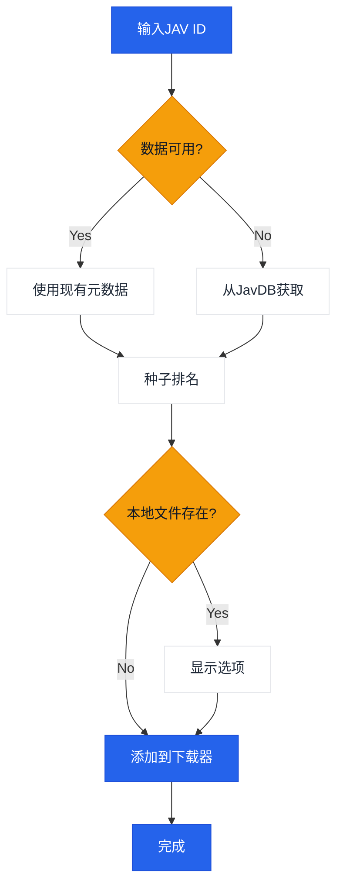

# JavManager

一个命令行工具，用于自动化管理JAV内容，具有快速重复搜索、种子搜索和qBittorrent集成功能。

[中文](README.zh-CN.md) | [日本語](README.ja.md) | [한국어](README.ko.md)

> **注意：** Everything（本地搜索）和qBittorrent（下载）是可选的集成功能。JavManager可以在没有它们的情况下工作（仍然可以搜索JavDB并输出磁力链接）。如果需要支持其他具有HTTP API的工具（例如其他搜索引擎或下载客户端），请[创建issue](../../issues/new)。

## 功能特性

- 从JavDB搜索JAV元数据和磁力链接
- 快速搜索
- 通过Everything搜索引擎检查本地文件
- 通过qBittorrent WebUI API下载
- 基于权重的智能种子选择排名

## 工作流程



## 外部依赖

| 服务 | 是否必需 | 用途 | 链接 |
|---------|----------|---------|------|
| JavDB | 是 | 元数据和磁力链接 | [javdb.com](https://javdb.com/) |
| Everything | 否（可选） | 本地文件搜索 | [voidtools.com](https://www.voidtools.com/everything-1.5a/) ([HTTP插件](https://www.voidtools.com/forum/viewtopic.php?f=12&t=9799)) |
| qBittorrent | 否（可选） | 种子下载 | [qBittorrent](https://github.com/qbittorrent/qBittorrent) |

### Cloudflare 403 问题

如果JavDB返回HTTP 403，很可能是由于Cloudflare挑战。JavManager默认使用**curl-impersonate来模拟真实浏览器的TLS/HTTP2指纹（无浏览器自动化）**。如果仍然看到403，请尝试不同的镜像URL，或检查您的IP是否被阻止（参见`doc/CloudflareBypass.md`）。

## 配置

所有设置在`JavManager/appsettings.json`中配置（本地覆盖使用`appsettings.Development.json`）。不支持环境变量覆盖。

配置参考：

| 部分 | 键 | 是否必需 | 默认值 | 描述 |
|---------|-----|----------|---------|-------------|
| Everything | `BaseUrl` | 否（可选） | `http://localhost` | Everything HTTP服务器基础URL（包含协议和主机）。如果不可用，则跳过本地去重。 |
| Everything | `UserName` | 否（可选） | _(空)_ | Basic认证用户名。 |
| Everything | `Password` | 否（可选） | _(空)_ | Basic认证密码。 |
| QBittorrent | `BaseUrl` | 否（可选） | `http://localhost:8080` | qBittorrent WebUI基础URL（如果需要包含端口）。如果不可用/认证失败，JavManager会打印磁力链接而不添加到下载队列。 |
| QBittorrent | `UserName` | 否（可选） | `admin` | WebUI用户名。 |
| QBittorrent | `Password` | 否（可选） | _(空)_ | WebUI密码。 |
| JavDb | `BaseUrl` | 是 | `https://javdb.com` | 主JavDB基础URL。 |
| JavDb | `MirrorUrls` | 否（可选） | `[]` | 额外镜像URL（数组）。 |
| JavDb | `RequestTimeout` | 否（可选） | `30000` | 请求超时（毫秒）。 |
| JavDb | `UserAgent` | 否（可选） | _(空)_ | 自定义User-Agent字符串（仅在HttpClient回退模式中使用）。 |
| JavDb | `CurlImpersonate:Enabled` | 否（可选） | `true` | 为JavDB请求启用curl-impersonate（推荐）。 |
| JavDb | `CurlImpersonate:Target` | 否（可选） | `chrome116` | `curl_easy_impersonate()`的模拟目标名称（例如 `chrome116`）。 |
| JavDb | `CurlImpersonate:LibraryPath` | 否（可选） | _(空)_ | 可选的`libcurl.dll`显式路径（否则自动检测）。 |
| JavDb | `CurlImpersonate:CaBundlePath` | 否（可选） | _(空)_ | 可选的`cacert.pem`路径（否则自动检测）。 |
| JavDb | `CurlImpersonate:DefaultHeaders` | 否（可选） | `true` | 使用curl-impersonate内置的默认HTTP头。 |
| Download | `DefaultSavePath` | 否（可选） | _(空)_ | 将种子添加到qBittorrent时的默认下载路径。 |
| Download | `DefaultCategory` | 否（可选） | `jav` | qBittorrent中的默认分类。 |
| Download | `DefaultTags` | 否（可选） | `auto-download` | 创建下载的默认标签。 |
| LocalCache | `Enabled` | 否（可选） | `true` | 启用或禁用本地缓存存储。 |
| LocalCache | `DatabasePath` | 否（可选） | _(空)_ | JSON缓存文件路径（留空则使用可执行文件旁的默认`jav_cache.json`）。 |
| LocalCache | `CacheExpirationDays` | 否（可选） | `0` | 缓存TTL（天）（0禁用过期）。 |
| Console | `Language` | 否（可选） | `en` | UI语言（`en`、`zh`或`auto`）。 |
| Console | `HideOtherTorrents` | 否（可选） | `true` | 在列表中隐藏不匹配的种子。 |
| Telemetry | `Enabled` | 否（可选） | `true` | 启用或禁用匿名遥测。 |
| Telemetry | `Endpoint` | 否（可选） | _(空)_ | 遥测端点URL（留空使用默认值）。 |
| JavInfoSync | `Enabled` | 否（可选） | `false` | 启用或禁用JavInfo同步。 |
| JavInfoSync | `Endpoint` | 如果启用 | _(空)_ | JavInfo同步端点URL。 |
| JavInfoSync | `ApiKey` | 否（可选） | _(空)_ | 可选API密钥（通过`X-API-Key`发送）。 |

## 使用方法

```bash
# 交互模式
dotnet run --project JavManager/JavManager.csproj

# 直接搜索
dotnet run --project JavManager/JavManager.csproj -- STARS-001

# 显示帮助
dotnet run --project JavManager/JavManager.csproj -- help

# 显示版本
dotnet run --project JavManager/JavManager.csproj -- version
```

**交互命令：**

| 命令 | 描述 |
|---------|-------------|
| `<code>` | 按JAV代码搜索（例如 `STARS-001`）|
| `r <code>` | 刷新搜索|
| `c` | 显示保存的数据统计 |
| `h` | 显示帮助 |
| `q` | 退出 |

## 构建和打包

```bash
# 构建
dotnet build JavManager/JavManager.csproj

# 运行测试
dotnet test JavManager.Tests/JavManager.Tests.csproj

# 打包（Windows独立zip）
pwsh scripts/package.ps1

# 安装到PATH（Windows）
pwsh scripts/install-windows.ps1 -AddToPath
```