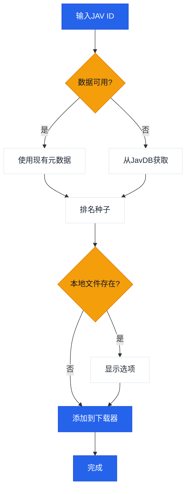

# JavManager

一个轻量级的GUI + CLI工具，用于自动化JAV内容管理，具有快速重复搜索、种子搜索和可选的qBittorrent集成功能。

[中文](README.zh-CN.md) | [日本語](README.ja.md) | [한국어](README.ko.md)

## 使用方法

```bash
# GUI
npx jav-manager --gui

# CLI (交互式)
npx jav-manager

# CLI (非交互式)
npx jav-manager STARS-001

# 帮助/版本
npx jav-manager help
npx jav-manager version
```

注意事项：
- Everything（本地搜索）和qBittorrent（下载）都是可选的集成功能。JavManager可以在没有它们的情况下工作（它仍然可以搜索JavDB并输出磁力链接）。
- 如果你已全局安装，请将`npx jav-manager`替换为`jav-manager` (`npm install -g jav-manager`)。
- 如果你需要支持其他具有HTTP API的工具（例如其他搜索引擎或下载客户端），请[创建问题](../../issues/new)。

## 功能特性

- GUI（本地Web界面）和控制台模式（Node.js）
- 多语言界面（英语、中文、日语、韩语）
- 从JavDB搜索JAV元数据和种子/磁力链接
- 通过Everything搜索引擎检查本地文件
- 通过qBittorrent WebUI API下载
- 本地JSON缓存用于重复搜索
- 基于权重的智能种子选择（标记+权重）

## 工作流程



## 外部依赖

| 服务 | 必需 | 用途 | 链接 |
|---------|----------|---------|------|
| JavDB | 是 | 元数据和磁力链接 | [javdb.com](https://javdb.com/) |
| Everything | 否（可选） | 本地文件搜索 | [voidtools.com](https://www.voidtools.com/everything-1.5a/) ([HTTP插件](https://www.voidtools.com/forum/viewtopic.php?f=12&t=9799)) |
| qBittorrent | 否（可选） | 种子下载 | [qBittorrent](https://github.com/qbittorrent/qBittorrent) |

### Cloudflare 403问题

如果JavDB返回HTTP 403，很可能是由于Cloudflare挑战。JavManager默认使用**curl-impersonate来模拟真实浏览器的TLS/HTTP2指纹（无浏览器自动化）**。如果你仍然看到403，请尝试不同的镜像URL或检查你的IP是否被阻止（参见`doc/CloudflareBypass.md`）。

### JavDB域名API

Cloudflare Worker提供了一个API端点，用于从官方网站获取最新的JavDB域名：

**端点：** `GET /api/javdb-domain`

**示例请求：**
```bash
curl https://your-worker-url/api/javdb-domain
```

**示例响应：**
```json
{
  "success": true,
  "domains": ["javdb565.com"]
}
```

**错误响应：**
```json
{
  "success": false,
  "error": "Failed to fetch domain from javdb.com",
  "message": "Could not extract latest domain from javdb.com"
}
```

此API实时从`https://javdb.com/`获取最新的JavDB域名。API包含10秒超时和适当的错误处理。

### 遥测 + "Jav趋势"（可选）

如果`Telemetry:Enabled`为true，JavManager可以发送：

- 启动事件到`POST /api/telemetry`
- JAV元数据到`POST /api/javinfo`（由Worker UI使用；重复报告会递增每个ID的搜索计数器）

Worker还提供了一个小型UI：

- `/` 概览
- `/jav` "Jav趋势"（最近的JavInfo记录+搜索计数）

## 配置

设置通过`appsettings.json`（和可选的`appsettings.Development.json`）配置。

配置文件位置：
- 如果设置了`JAVMANAGER_CONFIG_DIR`且存在，则从那里读取配置。
- 否则，JavManager首先在可执行目录中查找`appsettings.json`，然后在当前工作目录中查找。
- GUI"设置"和CLI `cfg set ...`将`appsettings.json`写入所选的配置目录（参见上面的查找规则）。

配置参考：

| 部分 | 键 | 必需 | 默认值 | 描述 |
|---------|-----|----------|---------|-------------|
| Everything | `BaseUrl` | 否（可选） | _(空)_ | Everything HTTP服务器基础URL（包含方案和主机）。如果不可用，则跳过本地去重。 |
| Everything | `UserName` | 否（可选） | _(空)_ | 基本认证用户名。 |
| Everything | `Password` | 否（可选） | _(空)_ | 基本认证密码。 |
| QBittorrent | `BaseUrl` | 否（可选） | _(空)_ | qBittorrent WebUI基础URL（如果需要请包含端口）。如果不可用/认证失败，JavManager会打印磁力链接而不添加到下载队列。 |
| QBittorrent | `UserName` | 否（可选） | _(空)_ | WebUI用户名。 |
| QBittorrent | `Password` | 否（可选） | _(空)_ | WebUI密码。 |
| JavDb | `BaseUrl` | 是 | `https://javdb.com` | 主要JavDB基础URL。 |
| JavDb | `MirrorUrls` | 否（可选） | `[]` | 其他镜像URL（数组）。 |
| JavDb | `RequestTimeout` | 否（可选） | `30000` | 请求超时（毫秒）。 |
| JavDb | `UserAgent` | 否（可选） | _(空)_ | 自定义User-Agent字符串（仅在HttpClient回退模式下使用）。 |
| JavDb | `CurlImpersonate:Enabled` | 否（可选） | `true` | 为JavDB请求启用curl-impersonate（推荐）。 |
| JavDb | `CurlImpersonate:Target` | 否（可选） | `chrome116` | `curl_easy_impersonate()`的模拟目标名称（例如`chrome116`）。 |
| JavDb | `CurlImpersonate:LibraryPath` | 否（可选） | _(空)_ | 可选的`libcurl.dll`显式路径（否则自动检测）。 |
| JavDb | `CurlImpersonate:CaBundlePath` | 否（可选） | _(空)_ | 可选的`cacert.pem`路径（否则自动检测）。 |
| JavDb | `CurlImpersonate:DefaultHeaders` | 否（可选） | `true` | 使用curl-impersonate内置的默认HTTP头。 |
| Download | `DefaultSavePath` | 否（可选） | _(空)_ | 将种子添加到qBittorrent时的默认下载路径。 |
| Download | `DefaultCategory` | 否（可选） | `jav` | qBittorrent中的默认类别。 |
| Download | `DefaultTags` | 否（可选） | `jav-manager` | 创建的下载的默认标签。 |
| LocalCache | `Enabled` | 否（可选） | `true` | 启用或禁用本地缓存存储。 |
| LocalCache | `DatabasePath` | 否（可选） | _(空)_ | JSON缓存文件路径（留空则默认为可执行文件旁边的`jav_cache.json`）。 |
| LocalCache | `CacheExpirationDays` | 否（可选） | `0` | 缓存TTL（天）（0禁用过期）。 |
| Console | `Language` | 否（可选） | `en` | UI语言（`en`或`zh`）。 |
| Console | `HideOtherTorrents` | 否（可选） | `true` | 在列表中隐藏不匹配的种子。 |
| Telemetry | `Enabled` | 否（可选） | `true` | 启用或禁用匿名遥测。 |
| Telemetry | `Endpoint` | 否（可选） | `https://jav-manager.techfetch.dev` | 基础端点（应用发布到`/api/telemetry`和`/api/javinfo`）。 |
| Update | `Enabled` | 否（可选） | `true` | 启用或禁用更新检查。 |
| Update | `AutoCheckOnStartup` | 否（可选） | `true` | 启动时自动检查更新（GUI）。 |
| Update | `GitHubRepo` | 否（可选） | `jqknono/jav-manager` | 用于更新检查的GitHub仓库。 |

注意事项：
- `JavInfoSync:*`是一个旧的章节名称；新版本使用`Telemetry:*`（应用仍然读取旧键以保持向后兼容）。
- 高级：配置还支持带有`JAVMANAGER_`前缀的环境变量（嵌套键使用`__`），但基于文件的配置是主要支持的方法。

## 开发

```bash
# 安装依赖
npm install

# 构建
npm run build

# 运行（GUI/CLI）
npm run gui
npm run cli

# 运行（编译的默认入口）
npm run start

# 测试
npm test
```