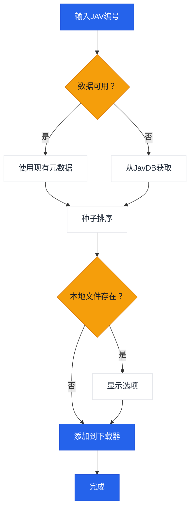

# JavManager

一款命令行工具，用于自动化管理JAV内容，支持快速重复搜索、种子搜索和qBittorrent集成。

[中文](README.zh-CN.md) | [日本語](README.ja.md) | [한국어](README.ko.md)

> **注意：** 当前支持Everything（本地搜索）和qBittorrent（下载）。如需支持其他具备HTTP API的工具（如其他搜索引擎或下载客户端），请[创建issue](../../issues/new)。

## 功能特性

- 从JavDB搜索JAV元数据和磁力链接
- 快速搜索
- 通过Everything搜索引擎检查本地文件
- 通过qBittorrent WebUI API下载
- 基于权重的智能种子选择排序

## 工作流程



## 外部依赖

| 服务 | 用途 | 链接 |
|---------|---------|------|
| Everything | 本地文件搜索 | [voidtools.com](https://www.voidtools.com/everything-1.5a/) ([HTTP插件](https://www.voidtools.com/forum/viewtopic.php?f=12&t=9799)) |
| JavDB | 元数据 & 磁力链接 | [javdb.com](https://javdb.com/) |
| qBittorrent | 种子下载 | [qBittorrent](https://github.com/qbittorrent/qBittorrent) |

### Cloudflare 403问题

如果JavDB返回HTTP 403，可能是由于Cloudflare验证导致。JavManager使用内置的类Chrome头部信息并会重试，无需第三方工具。如果仍遇到403，请从浏览器配置`cf_clearance`和匹配的`UserAgent`（参见`doc/CloudflareBypass.md`）。

## 配置

所有设置均在`JavManager/appsettings.json`中配置（使用`appsettings.Development.json`进行本地覆盖）。不支持环境变量覆盖。

### Everything

- `BaseUrl`: Everything HTTP服务器基础URL（包含协议和主机）
- `UserName`: 可选的基本认证用户名
- `Password`: 可选的基本认证密码

### QBittorrent

- `BaseUrl`: qBittorrent WebUI基础URL（如需请包含端口）
- `UserName`: WebUI用户名
- `Password`: WebUI密码

### JavDb

- `BaseUrl`: 主JavDB基础URL
- `MirrorUrls`: 备用镜像URL（数组）
- `RequestTimeout`: 请求超时（毫秒）
- `CfClearance`: `cf_clearance` cookie值
- `CfBm`: `__cf_bm` cookie值（可选）
- `UserAgent`: 与cookie来源匹配的浏览器User-Agent字符串

### Download

- `DefaultSavePath`: 种子默认下载路径
- `DefaultCategory`: qBittorrent中默认分类/标签
- `DefaultTags`: 创建下载的默认标签

### LocalCache

- `Enabled`: 启用/禁用本地缓存存储
- `DatabasePath`: 自定义数据库路径（空则使用默认）
- `CacheExpirationDays`: 缓存有效期（天，0表示永不过期）

### Console

- `Language`: 界面语言（`en`或`zh`）
- `HideOtherTorrents`: 在列表中隐藏不匹配的种子

### Telemetry

- `Enabled`: 启用/禁用匿名遥测
- `Endpoint`: 遥测端点URL

### JavInfoSync

- `Enabled`: 启用/禁用JavInfo同步
- `Endpoint`: JavInfo同步端点URL
- `ApiKey`: 可选API密钥（端点需要时使用）

## 使用方式

```bash
# 交互模式
dotnet run --project JavManager/JavManager.csproj

# 直接搜索
dotnet run --project JavManager/JavManager.csproj -- STARS-001

# 显示帮助
dotnet run --project JavManager/JavManager.csproj -- help

# 显示版本
dotnet run --project JavManager/JavManager.csproj -- version
```

**交互命令：**

| 命令 | 描述 |
|---------|-------------|
| `<编号>` | 按JAV编号搜索（例如`STARS-001`） |
| `r <编号>` | 刷新搜索 |
| `c` | 显示保存数据统计 |
| `h` | 显示帮助 |
| `q` | 退出 |

## 构建与打包

```bash
# 构建
dotnet build JavManager/JavManager.csproj

# 运行测试
dotnet test JavManager.Tests/JavManager.Tests.csproj

# 打包（Windows独立zip）
pwsh scripts/package.ps1

# 安装到PATH（Windows）
pwsh scripts/install-windows.ps1 -AddToPath
```