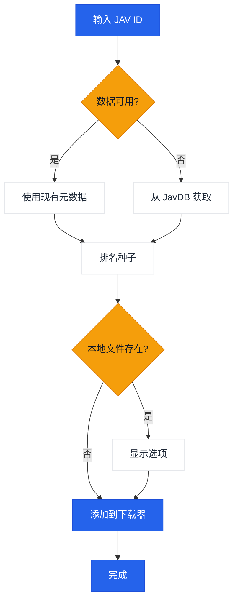

# JavManager

一个轻量级的 GUI + CLI 工具，用于自动化 JAV 内容管理，具有快速重复搜索、种子搜索和可选的 qBittorrent 集成功能。

[中文](README.zh-CN.md) | [日本語](README.ja.md) | [한국어](README.ko.md)

> **注意：** Everything（本地搜索）和 qBittorrent（下载）都是可选的集成功能。JavManager 可以在没有它们的情况下工作（它仍然可以搜索 JavDB 并输出磁力链接）。如果您需要支持其他具有 HTTP API 的工具（例如其他搜索引擎或下载客户端），请[创建 issue](../../issues/new)。

## 功能特性

- GUI (Avalonia) 和控制台模式 (Spectre.Console)
- 多语言 GUI（英语、中文、日语、韩语）
- 从 JavDB 搜索 JAV 元数据和种子/磁力链接
- 通过 Everything 搜索引擎检查本地文件
- 通过 qBittorrent WebUI API 下载
- 本地 JSON 缓存用于重复搜索
- 智能种子选择，基于权重的排名（标记 + 权重）

## 工作流程



## 外部依赖

| 服务 | 必需 | 用途 | 链接 |
|---------|----------|---------|------|
| JavDB | 是 | 元数据和磁力链接 | [javdb.com](https://javdb.com/) |
| Everything | 否（可选） | 本地文件搜索 | [voidtools.com](https://www.voidtools.com/everything-1.5a/) ([HTTP 插件](https://www.voidtools.com/forum/viewtopic.php?f=12&t=9799)) |
| qBittorrent | 否（可选） | 种子下载 | [qBittorrent](https://github.com/qbittorrent/qBittorrent) |

### Cloudflare 403 问题

如果 JavDB 返回 HTTP 403，很可能是由于 Cloudflare 挑战。JavManager 默认使用 **curl-impersonate 来模拟真实浏览器的 TLS/HTTP2 指纹（无浏览器自动化）。** 如果您仍然看到 403，请尝试不同的镜像 URL 或检查您的 IP 是否被阻止（参见 `doc/CloudflareBypass.md`）。

### JavDB 域名 API

Cloudflare Worker 提供了一个 API 端点，用于从官方网站获取最新的 JavDB 域名：

**端点：** `GET /api/javdb-domain`

**示例请求：**
```bash
curl https://your-worker-url/api/javdb-domain
```

**示例响应：**
```json
{
  "success": true,
  "domains": ["javdb565.com"]
}
```

**错误响应：**
```json
{
  "success": false,
  "error": "Failed to fetch domain from javdb.com",
  "message": "Could not extract latest domain from javdb.com"
}
```

此 API 实时从 `https://javdb.com/` 获取最新的 JavDB 域名。API 包含 10 秒超时和适当的错误处理。

### 遥测 + "Jav 趋势"（可选）

如果 `Telemetry:Enabled` 为 true，JavManager 可以发送：

- 启动事件到 `POST /api/telemetry`
- JAV 元数据到 `POST /api/javinfo`（由 worker UI 使用；重复报告会递增每个 ID 的搜索计数器）

worker 还提供了一个小型 UI：

- `/` 概览
- `/jav` "Jav 趋势"（最近的 JavInfo 记录 + 搜索计数）

## 配置

设置通过 `appsettings.json`（和可选的 `appsettings.Development.json`）配置。

- 开发环境：编辑 `JavManager/appsettings.json`（它会被复制到 `bin/Debug/net10.0/appsettings.json`）。
- 发布/单文件：应用程序在首次运行时会读取（如果不存在则创建）与可执行文件相邻的 `appsettings.json`。

配置参考：

| 章节 | 键 | 必需 | 默认值 | 描述 |
|---------|-----|----------|---------|-------------|
| Everything | `BaseUrl` | 否（可选） | _(空)_ | Everything HTTP 服务器基础 URL（包含协议和主机）。如果不可用，本地去重将被跳过。 |
| Everything | `UserName` | 否（可选） | _(空)_ | 基本认证用户名。 |
| Everything | `Password` | 否（可选） | _(空)_ | 基本认证密码。 |
| QBittorrent | `BaseUrl` | 否（可选） | _(空)_ | qBittorrent WebUI 基础 URL（如果需要包含端口）。如果不可用/认证失败，JavManager 会打印磁力链接而不添加到下载队列。 |
| QBittorrent | `UserName` | 否（可选） | _(空)_ | WebUI 用户名。 |
| QBittorrent | `Password` | 否（可选） | _(空)_ | WebUI 密码。 |
| JavDb | `BaseUrl` | 是 | `https://javdb.com` | 主要 JavDB 基础 URL。 |
| JavDb | `MirrorUrls` | 否（可选） | `[]` | 其他镜像 URL（数组）。 |
| JavDb | `RequestTimeout` | 否（可选） | `30000` | 请求超时（毫秒）。 |
| JavDb | `UserAgent` | 否（可选） | _(空)_ | 自定义 User-Agent 字符串（仅在 HttpClient 回退模式下使用）。 |
| JavDb | `CurlImpersonate:Enabled` | 否（可选） | `true` | 为 JavDB 请求启用 curl-impersonate（推荐）。 |
| JavDb | `CurlImpersonate:Target` | 否（可选） | `chrome116` | `curl_easy_impersonate()` 的模拟目标名称（例如 `chrome116`）。 |
| JavDb | `CurlImpersonate:LibraryPath` | 否（可选） | _(空)_ | `libcurl.dll` 的可选显式路径（否则自动检测）。 |
| JavDb | `CurlImpersonate:CaBundlePath` | 否（可选） | _(空)_ | `cacert.pem` 的可选路径（否则自动检测）。 |
| JavDb | `CurlImpersonate:DefaultHeaders` | 否（可选） | `true` | 使用 curl-impersonate 内置的默认 HTTP 头。 |
| Download | `DefaultSavePath` | 否（可选） | _(空)_ | 将种子添加到 qBittorrent 时的默认下载路径。 |
| Download | `DefaultCategory` | 否（可选） | `jav` | qBittorrent 中的默认类别。 |
| Download | `DefaultTags` | 否（可选） | `jav-manager` | 创建的下载的默认标签。 |
| LocalCache | `Enabled` | 否（可选） | `true` | 启用或禁用本地缓存存储。 |
| LocalCache | `DatabasePath` | 否（可选） | _(空)_ | JSON 缓存文件路径（留空则使用与可执行文件相邻的默认 `jav_cache.json`）。 |
| LocalCache | `CacheExpirationDays` | 否（可选） | `0` | 缓存 TTL（天）（0 表示禁用过期）。 |
| Console | `Language` | 否（可选） | `en` | UI 语言（`en`、`zh` 或 `auto`）。 |
| Console | `HideOtherTorrents` | 否（可选） | `true` | 在列表中隐藏不匹配的种子。 |
| Telemetry | `Enabled` | 否（可选） | `true` | 启用或禁用匿名遥测。 |
| Telemetry | `Endpoint` | 否（可选） | `https://jav-manager.techfetch.dev` | 基础端点（应用程序会发送到 `/api/telemetry` 和 `/api/javinfo`）。 |
| Update | `Enabled` | 否（可选） | `true` | 启用或禁用更新检查。 |
| Update | `AutoCheckOnStartup` | 否（可选） | `true` | 在启动时自动检查更新（GUI）。 |
| Update | `GitHubRepo` | 否（可选） | `jqknono/jav-manager` | 用于更新检查的 GitHub 仓库。 |

注意：
- `JavInfoSync:*` 是一个旧的章节名称；新版本使用 `Telemetry:*`（应用程序仍然读取旧键以保持向后兼容）。
- 高级：配置也支持带有 `JAVMANAGER_` 前缀的环境变量（嵌套键使用 `__），但基于文件的配置是主要支持的方法。

## 使用

```bash
# GUI（无参数时默认）
dotnet run --project JavManager/JavManager.csproj

# 控制台（交互式）
dotnet run --project JavManager/JavManager.csproj -- --no-gui

# 控制台（非交互式）
dotnet run --project JavManager/JavManager.csproj -- STARS-001

# 显示帮助
dotnet run --project JavManager/JavManager.csproj -- help

# 显示版本
dotnet run --project JavManager/JavManager.csproj -- version
```

对于控制台命令，运行 `dotnet run --project JavManager/JavManager.csproj -- help`。

## 构建和打包

```bash
# 构建
dotnet build JavManager/JavManager.csproj

# 运行测试
dotnet test JavManager.Tests/JavManager.Tests.csproj

# 发布（多 RID，自包含，输出到 artifacts/publish/<rid>/）
pwsh scripts/publish.ps1

# 安装到 PATH（Windows）
pwsh scripts/install-windows.ps1 -AddToPath
```

### Android（实验性）

Android 构建是可选的（这样桌面构建就不要求 Android 工作负载）。

```bash
# 安装工作负载（一次）
dotnet workload install android

# 构建 Android 目标（需要配置 Android SDK/JDK）
dotnet build JavManager/JavManager.csproj -c Debug -f net10.0-android -p:EnableAndroid=true
```