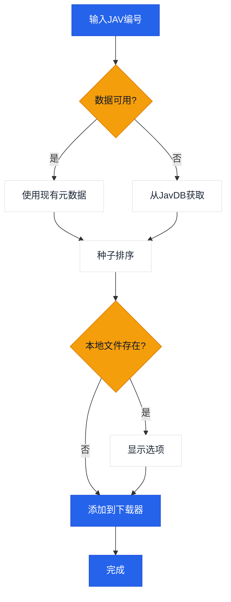

# JavManager

一个命令行工具，用于自动化管理JAV内容，支持快速重复搜索、种子搜索和qBittorrent集成。

[中文](README.zh-CN.md) | [日本語](README.ja.md) | [한국어](README.ko.md)

> **注意：** Everything（本地搜索）和qBittorrent（下载）是可选的集成功能。JavManager无需这些依赖也可运行（仍能搜索JavDB并输出磁力链接）。如需支持其他带HTTP API的工具（如其他搜索引擎或下载客户端），请[提交issue](../../issues/new)。

## 功能特性

- 从JavDB搜索JAV元数据和磁力链接
- 极速搜索
- 通过Everything搜索引擎检查本地文件
- 通过qBittorrent WebUI API下载
- 基于权重排名的智能种子选择

## 工作流程



## 外部依赖

| 服务 | 必需 | 用途 | 链接 |
|------|------|------|------|
| JavDB | 是 | 元数据 & 磁力链接 | [javdb.com](https://javdb.com/) |
| Everything | 否 (可选) | 本地文件搜索 | [voidtools.com](https://www.voidtools.com/everything-1.5a/) ([HTTP插件](https://www.voidtools.com/forum/viewtopic.php?f=12&t=9799)) |
| qBittorrent | 否 (可选) | 种子下载 | [qBittorrent](https://github.com/qbittorrent/qBittorrent) |

### Cloudflare 403问题

若JavDB返回HTTP 403，通常由Cloudflare验证导致。JavManager内置了类Chrome请求头并支持自动重试。如仍遇403，请配置从浏览器获取的`cf_clearance`和匹配的`UserAgent`（详见`doc/CloudflareBypass.md`）。

## 配置说明

所有设置均在`JavManager/appsettings.json`中配置（使用`appsettings.Development.json`进行本地覆盖）。不支持环境变量覆盖。

配置参考：

| 配置块 | 键名 | 必需 | 默认值 | 说明 |
|--------|------|------|---------|------|
| Everything | `BaseUrl` | 否 (可选) | `http://localhost` | Everything HTTP服务地址（需包含协议和主机）。若不可用，则跳过本地去重检查。 |
| Everything | `UserName` | 否 (可选) | _(空)_ | Basic认证用户名。 |
| Everything | `Password` | 否 (可选) | _(空)_ | Basic认证密码。 |
| QBittorrent | `BaseUrl` | 否 (可选) | `http://localhost:8080` | qBittorrent WebUI地址（需包含端口）。若不可用/认证失败，则直接输出磁力链接而不添加到下载队列。 |
| QBittorrent | `UserName` | 否 (可选) | `admin` | WebUI用户名。 |
| QBittorrent | `Password` | 否 (可选) | _(空)_ | WebUI密码。 |
| JavDb | `BaseUrl` | 是 | `https://javdb.com` | 主JavDB地址。 |
| JavDb | `MirrorUrls` | 否 (可选) | `[]` | 镜像站URL数组。 |
| JavDb | `RequestTimeout` | 否 (可选) | `30000` | 请求超时时间（毫秒）。 |
| JavDb | `CfClearance` | 有时需要 | _(空)_ | `cf_clearance` cookie值（Cloudflare验证激活时需要）。 |
| JavDb | `CfBm` | 否 (可选) | _(空)_ | `__cf_bm` cookie值（可选，可提升成功率）。 |
| JavDb | `UserAgent` | 有时需要 | _(空)_ | 匹配cookie来源的浏览器User-Agent字符串（使用Cloudflare cookie时需要）。 |
| Download | `DefaultSavePath` | 否 (可选) | _(空)_ | 添加到qBittorrent时的默认下载路径。 |
| Download | `DefaultCategory` | 否 (可选) | `jav` | qBittorrent中的默认分类。 |
| Download | `DefaultTags` | 否 (可选) | `auto-download` | 创建的下载任务默认标签。 |
| LocalCache | `Enabled` | 否 (可选) | `true` | 是否启用本地缓存。 |
| LocalCache | `DatabasePath` | 否 (可选) | _(空)_ | JSON缓存文件路径（留空则使用默认路径`jav_cache.json`）。 |
| LocalCache | `CacheExpirationDays` | 否 (可选) | `0` | 缓存有效期天数（0表示永不过期）。 |
| Console | `Language` | 否 (可选) | `en` | 界面语言（`en`, `zh`, 或 `auto`）。 |
| Console | `HideOtherTorrents` | 否 (可选) | `true` | 是否隐藏列表中不匹配的种子。 |
| Telemetry | `Enabled` | 否 (可选) | `true` | 是否启用匿名遥测。 |
| Telemetry | `Endpoint` | 否 (可选) | _(空)_ | 遥测端点URL（留空使用默认地址）。 |
| JavInfoSync | `Enabled` | 否 (可选) | `false` | 是否启用JavInfo同步。 |
| JavInfoSync | `Endpoint` | 启用时必需 | _(空)_ | JavInfo同步端点URL。 |
| JavInfoSync | `ApiKey` | 否 (可选) | _(空)_ | 可选API密钥（通过`X-API-Key`头发送）。 |

## 使用方法

```bash
# 交互模式
dotnet run --project JavManager/JavManager.csproj

# 直接搜索
dotnet run --project JavManager/JavManager.csproj -- STARS-001

# 显示帮助
dotnet run --project JavManager/JavManager.csproj -- help

# 显示版本
dotnet run --project JavManager/JavManager.csproj -- version
```

**交互命令：**

| 命令 | 说明 |
|------|------|
| `<编号>` | 按JAV编号搜索（如`STARS-001`） |
| `r <编号>` | 刷新搜索 |
| `c` | 显示缓存统计 |
| `h` | 显示帮助 |
| `q` | 退出 |

## 构建与打包

```bash
# 构建
dotnet build JavManager/JavManager.csproj

# 运行测试
dotnet test JavManager.Tests/JavManager.Tests.csproj

# 打包（Windows独立zip）
pwsh scripts/package.ps1

# 安装到PATH（Windows）
pwsh scripts/install-windows.ps1 -AddToPath
```