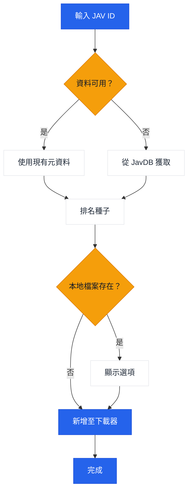

# JavManager

一個輕量級的 GUI + CLI 工具，用於自動化 JAV 內容管理，具備快速重複搜尋、種子搜尋以及選用的 qBittorrent 整合功能。

[繁體中文](README.zh-TW.md) | [日本語](README.ja.md) | [한국어](README.ko.md)

## 使用方式

```bash
# GUI 模式
npx jav-manager --gui

# CLI 模式 (互動式)
npx jav-manager

# CLI 模式 (非互動式)
npx jav-manager STARS-001

# 說明 / 版本
npx jav-manager help
npx jav-manager version
```

注意事項：
- Everything (本地搜尋) 和 qBittorrent (下載) 是選用的整合功能。JavManager 沒有它們也能運作 (仍然可以搜尋 JavDB 並輸出磁力連結)。
- 如果您是全域安裝 (`npm install -g jav-manager`)，請將 `npx jav-manager` 替換為 `jav-manager`。
- 如果您需要支援其他具有 HTTP API 的工具 (例如其他搜尋引擎或下載用戶端)，請[建立 issue](../../issues/new)。

## 功能

- GUI (本地網頁 UI) 與主控台模式 (Node.js)
- 多語言 UI (英文、中文、日文、韓文)
- 從 JavDB 搜尋 JAV 元資料與種子/磁力連結
- 透過 Everything 搜尋引擎檢查本地檔案
- 透過 qBittorrent WebUI API 下載
- 本地 JSON 快取以供重複搜尋
- 智慧種子選擇，採用基於權重的排名 (標記 + 權重)

## 工作流程



## 外部相依性

| 服務 | 必須 | 用途 | 連結 |
|---------|----------|---------|------|
| JavDB | 是 | 元資料與磁力連結 | [javdb.com](https://javdb.com/) |
| Everything | 否 (選用) | 本地檔案搜尋 | [voidtools.com](https://www.voidtools.com/everything-1.5a/) ([HTTP 外掛](https://www.voidtools.com/forum/viewtopic.php?f=12&t=9799)) |
| qBittorrent | 否 (選用) | 種子下載 | [qBittorrent](https://github.com/qbittorrent/qBittorrent) |

### Cloudflare 403 問題

如果 JavDB 回傳 HTTP 403，可能是因為 Cloudflare 驗證。JavManager **預設使用 curl-impersonate** 來模擬真實瀏覽器的 TLS/HTTP2 指紋 (無需瀏覽器自動化)。如果您仍然看到 403，請嘗試不同的鏡像 URL 或檢查您的 IP 是否被封鎖 (請參閱 `doc/CloudflareBypass.md`)。

### JavDB 域名 API

Cloudflare Worker 提供了一個 API 端點，用於從官方網站獲取最新的 JavDB 域名：

**端點：** `GET /api/javdb-domain`

**範例請求：**
```bash
curl https://your-worker-url/api/javdb-domain
```

**範例回應：**
```json
{
  "success": true,
  "domains": ["javdb565.com"]
}
```

**錯誤回應：**
```json
{
  "success": false,
  "error": "Failed to fetch domain from javdb.com",
  "message": "Could not extract latest domain from javdb.com"
}
```

此 API 即時從 `https://javdb.com/` 獲取最新的 JavDB 域名。該 API 包含 10 秒逾時和適當的錯誤處理。

### 遙測 + "Jav 趨勢" (選用)

如果 `Telemetry:Enabled` 為 true，JavManager 可以發送：

- 啟動事件至 `POST /api/telemetry`
- JAV 元資料至 `POST /api/javinfo` (由 worker UI 使用；重複回報會增加每個 ID 的搜尋計數)

Worker 也提供一個小型 UI：

- `/` 概覽
- `/jav` "Jav 趨勢" (最近的 JavInfo 紀錄 + 搜尋計數)

## 設定

設定透過 `appsettings.json` (以及選用的 `appsettings.Development.json`) 進行配置。

設定檔位置：
- 如果設定了 `JAVMANAGER_CONFIG_DIR` 且存在，則從該處讀取設定。
- 否則，JavManager 會先在執行檔目錄中尋找 `appsettings.json`，然後是目前的工作目錄。
- GUI 的 "Settings" 和 CLI 的 `cfg set ...` 會將 `appsettings.json` 寫入選定的設定目錄 (請參閱上方的查找規則)。

設定參考：

| 區段 | 鍵值 | 必須 | 預設值 | 描述 |
|---------|-----|----------|---------|-------------|
| Everything | `BaseUrl` | 否 (選用) | _(空)_ | Everything HTTP 伺服器基礎 URL (包含協定和主機)。若無法使用，則跳過本地去重。 |
| Everything | `UserName` | 否 (選用) | _(空)_ | 基本驗證使用者名稱。 |
| Everything | `Password` | 否 (選用) | _(空)_ | 基本驗證密碼。 |
| QBittorrent | `BaseUrl` | 否 (選用) | _(空)_ | qBittorrent WebUI 基礎 URL (視需要包含連接埠)。若無法使用/驗證失敗，JavManager 會列印磁力連結而不新增至下載佇列。 |
| QBittorrent | `UserName` | 否 (選用) | _(空)_ | WebUI 使用者名稱。 |
| QBittorrent | `Password` | 否 (選用) | _(空)_ | WebUI 密碼。 |
| JavDb | `BaseUrl` | 是 | `https://javdb.com` | 主要 JavDB 基礎 URL。 |
| JavDb | `MirrorUrls` | 否 (選用) | `[]` | 額外的鏡像 URL (陣列)。 |
| JavDb | `RequestTimeout` | 否 (選用) | `30000` | 請求逾時 (毫秒)。 |
| JavDb | `UserAgent` | 否 (選用) | _(空)_ | 自訂 User-Agent 字串 (僅在 HttpClient 後備模式中使用)。 |
| JavDb | `CurlImpersonate:Enabled` | 否 (選用) | `true` | 為 JavDB 請求啟用 curl-impersonate (建議)。 |
| JavDb | `CurlImpersonate:Target` | 否 (選用) | `chrome116` | `curl_easy_impersonate()` 的模擬目標名稱 (例如 `chrome116`)。 |
| JavDb | `CurlImpersonate:LibraryPath` | 否 (選用) | _(空)_ | `libcurl.dll` 的選用明確路徑 (否則自動偵測)。 |
| JavDb | `CurlImpersonate:CaBundlePath` | 否 (選用) | _(空)_ | `cacert.pem` 的選用路徑 (否則自動偵測)。 |
| JavDb | `CurlImpersonate:DefaultHeaders` | 否 (選用) | `true` | 使用 curl-impersonate 內建的預設 HTTP 標頭。 |
| Download | `DefaultSavePath` | 否 (選用) | _(空)_ | 將種子新增至 qBittorrent 時的預設下載路徑。 |
| Download | `DefaultCategory` | 否 (選用) | `jav` | qBittorrent 中的預設分類。 |
| Download | `DefaultTags` | 否 (選用) | `jav-manager` | 建立下載時的預設標籤。 |
| LocalCache | `Enabled` | 否 (選用) | `true` | 啟用或停用本地快取儲存。 |
| LocalCache | `DatabasePath` | 否 (選用) | _(空)_ | JSON 快取檔案路徑 (留空則使用執行檔旁的預設 `jav_cache.json`)。 |
| LocalCache | `CacheExpirationDays` | 否 (選用) | `0` | 快取 TTL (天) (0 表示停用過期)。 |
| Console | `Language` | 否 (選用) | `en` | UI 語言 (`en` 或 `zh`)。 |
| Console | `HideOtherTorrents` | 否 (選用) | `true` | 隱藏清單中不相符的種子。 |
| Telemetry | `Enabled` | 否 (選用) | `true` | 啟用或停用匿名遙測。 |
| Telemetry | `Endpoint` | 否 (選用) | `https://jav-manager.techfetch.dev` | 基礎端點 (應用程式發送至 `/api/telemetry` 和 `/api/javinfo`)。 |
| Update | `Enabled` | 否 (選用) | `true` | 啟用或停用更新檢查。 |
| Update | `AutoCheckOnStartup` | 否 (選用) | `true` | 啟動時自動檢查更新 (GUI)。 |
| Update | `GitHubRepo` | 否 (選用) | `jqknono/jav-manager` | 用於更新檢查的 GitHub 儲存庫。 |

注意事項：
- `JavInfoSync:*` 是舊版區段名稱；較新的組建版本使用 `Telemetry:*` (應用程式仍會讀取舊版金鑰以向後相容)。
- 進階：設定也支援帶有 `JAVMANAGER_` 前綴的環境變數 (巢狀金鑰使用 `__`)，但檔案型設定是主要支援的方法。

## 開發

```bash
# 安裝相依套件
npm install

# 建置
npm run build

# 執行 (GUI / CLI)
npm run gui
npm run cli

# 執行 (編譯後的預設入口)
npm run start

# 測試
npm test
```