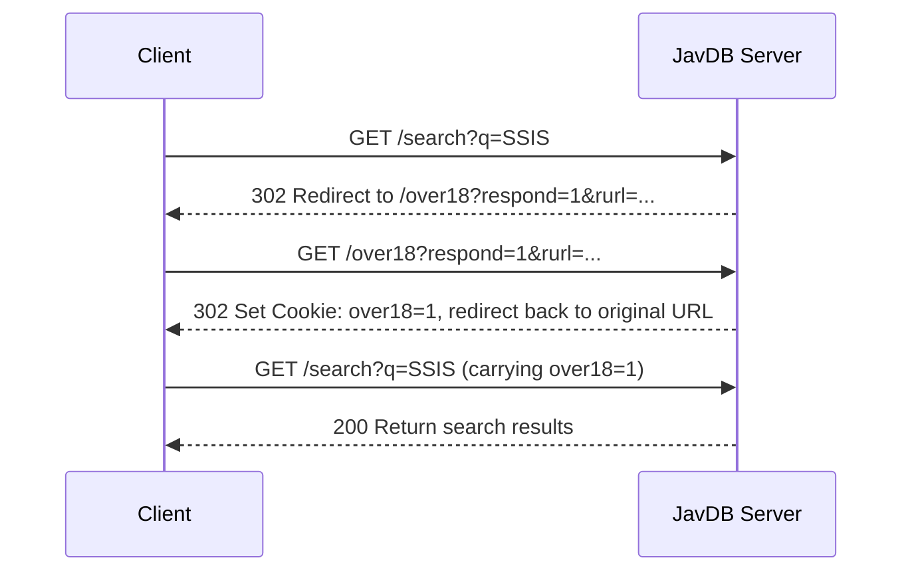

# JavDB API Documentation

## Overview

JavDB is a video content database website built on the Ruby on Rails framework, using Cloudflare for protection.

### Basic Information

| Item | Value |
|------|-------|
| Main Domain | `https://javdb.com/` |
| Mirror Domains | `javdb565.com`, `javdb564.com` |
| Web Framework | Ruby on Rails |
| Protection | Cloudflare |
| Authentication | CSRF Token |

---

## Endpoint List

### 1. Home Page
```
GET https://javdb.com/
```

**Response Content**:
- Latest video list
- Popular tags
- Recommended content

### 2. Search
```
GET https://javdb.com/search?q=KEYWORD&f=FILTER
```

**Parameters**:
| Parameter | Type | Required | Description |
|-----------|------|----------|-------------|
| q | string | Yes | Search keyword |
| f | string | No | Filter type (see filter list below) |

**Example Request**:
```
GET https://javdb.com/search?q=SSIS&f=all
```

### 3. Actor List
```
GET https://javdb.com/actors
```

**Response Content**:
- Actor avatars
- Actor names
- Actor IDs

### 4. Actor Details
```
GET https://javdb.com/actors/ACTOR_ID
```

**Example**:
```
GET https://javdb.com/actors/OWl
```

### 5. Video Details
```
GET https://javdb.com/v/VIDEO_ID
```

**Note**: This endpoint requires login authentication, direct requests will return 403 Forbidden.

### 6. Series
```
GET https://javdb.com/series
```

### 7. Studios
```
GET https://javdb.com/studios
```

---

## Filter Parameters

| Parameter Value | Description | Chinese Name |
|-----------------|-------------|--------------|
| `all` | All videos | 全部 |
| `censored` | Censored videos | 有碼 |
| `uncensored` | Uncensored videos | 無碼 |
| `western` | Western content | 歐美 |
| `fc2` | FC2 content | FC2 |
| `anime` | Anime content | 動漫 |

---

## Image CDN Structure

### Cover Images
```
https://c0.jdbstatic.com/covers/{2char}/{filename}.jpg
```

**Example**:
```
https://c0.jdbstatic.com/covers/9d/9DGB5X.jpg
```

### Actor Avatars
```
https://c0.jdbstatic.com/avatars/{2char}/{filename}.jpg
```

### Site Logo
```
https://c0.jdbstatic.com/images/logo_120x120.png
```

---

## Data Structure

### Video Object
```
{
  "id": "SSIS-589",           // Video ID
  "title": "Video Title",      // Japanese title
  "cover": "Cover Image URL",  // Cover image link
  "rating": "4.43",            // Rating
  "rating_count": 2164,        // Number of ratings
  "release_date": "2023-01-01", // Release date
  "tags": ["含中字磁鏈", "中字可播放"], // Tags
  "video_url": "/v/VIDEO_ID"  // Detail page link
}
```

### Actor Object
```
{
  "id": "OWl",                // Actor ID
  "name": "Actor Name",        // Actor name
  "avatar": "Avatar URL",       // Avatar image link
  "url": "/actors/OWl"        // Detail page link
}
```

---

## Authentication Mechanism

JavDB uses Ruby on Rails' CSRF Token mechanism for authentication:

```html
<meta name="csrf-param" content="authenticity_token" />
<meta name="csrf-token" content="TOKEN_VALUE" />
```

**Important Notes**:
- Most pages require a valid CSRF Token
- Video detail page `/v/VIDEO_ID` requires user login
- Direct HTTP requests will be blocked by Cloudflare (403 Forbidden)

---

## Cookies Requirements

### Required Cookies

| Cookie Name | Value | Description | Expiration |
|-------------|-------|-------------|------------|
| `over18` | `1` | Age verification, must be set to 1 for normal access to search API | 1 year |
| `_jdb_session` | Auto-generated | Rails session cookie, automatically generated and updated by the server | End of session |

### Optional Cookies

| Cookie Name | Value | Description |
|-------------|-------|-------------|
| `locale` | `zh` | Language setting (zh = Traditional Chinese) |
| `list_mode` | `h` | List display mode (h = horizontal list) |
| `theme` | `auto` | Theme setting (auto = follow system) |

### Analytics Cookies (Optional)

These cookies are used by Yandex Analytics and do not affect API functionality:

| Cookie Name | Description |
|-------------|-------------|
| `_ym_uid` | Yandex user ID |
| `_ym_d` | Yandex visit date |
| `_ym_isad` | Yandex ad detection |

### Cookie Setting Example

```bash
# Minimum required cookie setting
Cookie: over18=1

# Complete cookie setting example
Cookie: over18=1; locale=zh; list_mode=h; theme=auto; _jdb_session=<auto-generated session value>
```

**Note**: The `_jdb_session` cookie is automatically set by the server on first visit, no manual generation required.

---

## HTTP Request Header Requirements

### Required Request Headers

| Request Header | Value Example | Description |
|----------------|---------------|-------------|
| `User-Agent` | `Mozilla/5.0 (Windows NT 10.0; Win64; x64) AppleWebKit/537.36 (KHTML, like Gecko) Chrome/143.0.0.0 Safari/537.36` | Must use a real browser User-Agent |
| `Accept` | `text/html,application/xhtml+xml,application/xml;q=0.9,image/avif,image/webp,image/apng,*/*;q=0.8,application/signed-exchange;v=b3;q=0.7` | Specify acceptable response types |
| `Accept-Language` | `zh-CN,zh;q=0.9` | Language preference |
| `Cookie` | `over18=1` | Required cookies |

### Recommended Request Headers (for passing Cloudflare protection)

| Request Header | Value Example | Description |
|----------------|---------------|-------------|
| `Accept-Encoding` | `gzip, deflate, br, zstd` | Supported compression encodings |
| `Sec-Fetch-Dest` | `document` | Request destination type |
| `Sec-Fetch-Mode` | `navigate` | Request mode |
| `Sec-Fetch-Site` | `same-origin` | Request site relationship |
| `Sec-Fetch-User` | `?1` | Indicates user-initiated request |
| `Sec-Ch-Ua` | `"Google Chrome";v="143", "Chromium";v="143", "Not A(Brand";v="24"` | Chrome UA information |
| `Sec-Ch-Ua-Mobile` | `?0` | Whether it's a mobile device |
| `Sec-Ch-Ua-Platform` | `"Windows"` | Operating system platform |

### Complete Request Example

```bash
curl "https://javdb.com/search?q=SSIS&f=all" \
  -H "User-Agent: Mozilla/5.0 (Windows NT 10.0; Win64; x64) AppleWebKit/537.36 (KHTML, like Gecko) Chrome/143.0.0.0 Safari/537.36" \
  -H "Accept: text/html,application/xhtml+xml,application/xml;q=0.9,image/avif,image/webp,image/apng,*/*;q=0.8,application/signed-exchange;v=b3;q=0.7" \
  -H "Accept-Language: zh-CN,zh;q=0.9" \
  -H "Accept-Encoding: gzip, deflate, br, zstd" \
  -H "Cookie: over18=1; locale=zh" \
  -H "Sec-Fetch-Dest: document" \
  -H "Sec-Fetch-Mode: navigate" \
  -H "Sec-Fetch-Site: same-origin" \
  -H "Sec-Fetch-User: ?1"
```

### C# HttpClient Configuration Example

```csharp
var httpClient = new HttpClient();

// Set User-Agent
httpClient.DefaultRequestHeaders.Add("User-Agent",
    "Mozilla/5.0 (Windows NT 10.0; Win64; x64) AppleWebKit/537.36 (KHTML, like Gecko) Chrome/143.0.0.0 Safari/537.36");

// Set Accept
httpClient.DefaultRequestHeaders.Add("Accept",
    "text/html,application/xhtml+xml,application/xml;q=0.9,image/avif,image/webp,image/apng,*/*;q=0.8");

// Set Accept-Language
httpClient.DefaultRequestHeaders.Add("Accept-Language", "zh-CN,zh;q=0.9");

// Set required cookies
httpClient.DefaultRequestHeaders.Add("Cookie", "over18=1; locale=zh");

// Set Sec-Fetch headers (optional, but helps pass Cloudflare)
httpClient.DefaultRequestHeaders.Add("Sec-Fetch-Dest", "document");
httpClient.DefaultRequestHeaders.Add("Sec-Fetch-Mode", "navigate");
httpClient.DefaultRequestHeaders.Add("Sec-Fetch-Site", "same-origin");
httpClient.DefaultRequestHeaders.Add("Sec-Fetch-User", "?1");
```

---

## Age Verification Flow

JavDB uses an age verification mechanism. On first access, it redirects to the `/over18` endpoint:

### Verification Flow



### Manual Age Verification Handling

If directly accessing the search API returns 403 or redirects to `/over18`, you need to:

1. First visit `https://javdb.com/over18?respond=1` to set the `over18=1` cookie
2. Get the Set-Cookie header from the response
3. Carry the `over18=1` cookie in subsequent requests

```bash
# Step 1: Visit age verification endpoint
curl -i "https://javdb.com/over18?respond=1" \
  -H "User-Agent: Mozilla/5.0 (Windows NT 10.0; Win64; x64) AppleWebKit/537.36" \
  -H "Cookie: over18=1"

# Step 2: Use the returned cookie for search
curl "https://javdb.com/search?q=SSIS&f=all" \
  -H "User-Agent: Mozilla/5.0 (Windows NT 10.0; Win64; x64) AppleWebKit/537.36" \
  -H "Cookie: over18=1; locale=zh"
```

---

## Error Handling

### HTTP Status Codes

| Status Code | Description | Cause |
|-------------|-------------|-------|
| 200 | Success | Request successful |
| 302 | Found | Redirect (usually age verification) |
| 403 | Forbidden | Blocked by Cloudflare or missing required cookies/headers |
| 404 | Not Found | Resource does not exist |

### Common Errors

**1. 403 Forbidden - Missing Required Cookies**

```
Error message:
Response status code does not indicate success: 403 (Forbidden)
```

**Cause**:
- Missing `over18=1` cookie
- Incorrect or missing User-Agent
- Missing required request headers

**Solution**:
```csharp
// Ensure required cookie is set
httpClient.DefaultRequestHeaders.Add("Cookie", "over18=1");

// Set complete User-Agent
httpClient.DefaultRequestHeaders.Add("User-Agent",
    "Mozilla/5.0 (Windows NT 10.0; Win64; x64) AppleWebKit/537.36 (KHTML, like Gecko) Chrome/143.0.0.0 Safari/537.36");
```

**2. 302 Redirect - Age Verification**

```
Response header:
Location: /over18?respond=1&rurl=...
```

**Cause**:
- First visit without `over18=1` cookie set

**Solution**:
```bash
# Method 1: Directly set over18=1 cookie
curl "https://javdb.com/search?q=SSIS&f=all" \
  -H "Cookie: over18=1"

# Method 2: First visit age verification endpoint
curl -L "https://javdb.com/over18?respond=1" \
  -H "Cookie: over18=1"
```

**3. 403 Forbidden - Cloudflare Protection**

```
Error message:
cf-mitigated: 1
CF-RAY: xxxxxxxx-SIN
```

**Cause**:
- Incomplete request headers, identified as a crawler by Cloudflare

**Solution**:
- Add complete Sec-Fetch series request headers
- Add Sec-Ch-Ua series request headers
- Ensure using a real browser User-Agent

```csharp
// Add Sec-Fetch series request headers
httpClient.DefaultRequestHeaders.Add("Sec-Fetch-Dest", "document");
httpClient.DefaultRequestHeaders.Add("Sec-Fetch-Mode", "navigate");
httpClient.DefaultRequestHeaders.Add("Sec-Fetch-Site", "same-origin");
httpClient.DefaultRequestHeaders.Add("Sec-Fetch-User", "?1");

// Add Sec-Ch-Ua series request headers
httpClient.DefaultRequestHeaders.Add("Sec-Ch-Ua",
    "\"Google Chrome\";v=\"143\", \"Chromium\";v=\"143\", \"Not A(Brand\";v=\"24\"");
httpClient.DefaultRequestHeaders.Add("Sec-Ch-Ua-Mobile", "?0");
httpClient.DefaultRequestHeaders.Add("Sec-Ch-Ua-Platform", "\"Windows\"");
```

---

## Usage Examples

### Search Example
```bash
# Search for "SSIS" keyword
curl "https://javdb.com/search?q=SSIS&f=all" \
  -H "User-Agent: Mozilla/5.0" \
  -H "Accept: text/html"
```

### Get Actor List
```bash
curl "https://javdb.com/actors" \
  -H "User-Agent: Mozilla/5.0"
```

---

## Important Notes

1. **Cloudflare Protection**: Direct API requests may be blocked; it is recommended to use browser automation tools
2. **Login Requirements**: Video detail pages require user login
3. **Rate Limiting**: Avoid frequent requests, as you may be identified as a crawler by Cloudflare
4. **Mirror Domains**: The main domain may be blocked; mirror domains can be used for access

---

## Changelog

| Date | Update Content |
|------|----------------|
| 2026-01-19 | Added Cookies requirements and HTTP request header detailed instructions, including required and optional cookies, complete request header configuration, age verification flow, and error handling |
| 2026-01-18 | Initial version, created based on JavDB website analysis |
