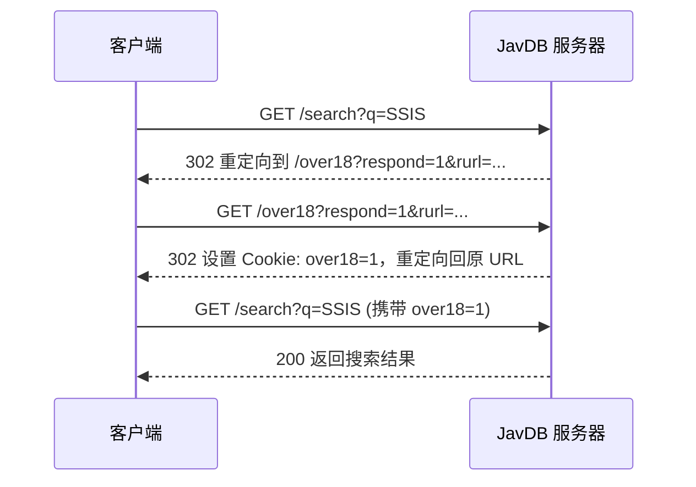

# JavDB API 文档

## 概述

JavDB 是一个视频内容数据库网站，基于 Ruby on Rails 框架构建，使用 Cloudflare 进行防护。

### 基本信息

| 项目 | 值 |
|------|-----|
| 主域名 | `https://javdb.com/` |
| 镜像域名 | `javdb565.com`, `javdb564.com` |
| Web 框架 | Ruby on Rails |
| 防护 | Cloudflare |
| 认证方式 | CSRF Token |

---

## 端点列表

### 1. 首页
```
GET https://javdb.com/
```

**响应内容**：
- 最新视频列表
- 热门标签
- 推荐内容

### 2. 搜索
```
GET https://javdb.com/search?q=KEYWORD&f=FILTER
```

**参数**：
| 参数 | 类型 | 必需 | 描述 |
|------|------|------|------|
| q | string | 是 | 搜索关键词 |
| f | string | 否 | 过滤器类型（见下方过滤器列表） |

**示例请求**：
```
GET https://javdb.com/search?q=SSIS&f=all
```

### 3. 演员列表
```
GET https://javdb.com/actors
```

**响应内容**：
- 演员头像
- 演员名称
- 演员ID

### 4. 演员详情
```
GET https://javdb.com/actors/ACTOR_ID
```

**示例**：
```
GET https://javdb.com/actors/OWl
```

### 5. 视频详情
```
GET https://javdb.com/v/VIDEO_ID
```

**注意**：此端点需要登录认证，直接请求会返回 403 Forbidden。

### 6. 系列
```
GET https://javdb.com/series
```

### 7. 制作商
```
GET https://javdb.com/studios
```

---

## 过滤器参数

| 参数值 | 描述 | 中文名称 |
|--------|------|----------|
| `all` | 所有视频 | 全部 |
| `censored` | 有码视频 | 有碼 |
| `uncensored` | 无码视频 | 無碼 |
| `western` | 欧美内容 | 歐美 |
| `fc2` | FC2 内容 | FC2 |
| `anime` | 动漫内容 | 動漫 |

---

## 图片 CDN 结构

### 封面图片
```
https://c0.jdbstatic.com/covers/{2char}/{filename}.jpg
```

**示例**：
```
https://c0.jdbstatic.com/covers/9d/9DGB5X.jpg
```

### 演员头像
```
https://c0.jdbstatic.com/avatars/{2char}/{filename}.jpg
```

### 站点 Logo
```
https://c0.jdbstatic.com/images/logo_120x120.png
```

---

## 数据结构

### 视频对象
```
{
  "id": "SSIS-589",           // 视频 ID
  "title": "视频标题",         // 日文标题
  "cover": "封面图片URL",      // 封面图片链接
  "rating": "4.43",           // 评分
  "rating_count": 2164,       // 评价人数
  "release_date": "2023-01-01", // 发行日期
  "tags": ["含中字磁鏈", "中字可播放"], // 标签
  "video_url": "/v/VIDEO_ID"  // 详情页链接
}
```

### 演员对象
```
{
  "id": "OWl",                // 演员 ID
  "name": "演员名称",          // 演员
  "avatar": "头像URL",         // 头像图片链接
  "url": "/actors/OWl"        // 详情页链接
}
```

---

## 认证机制

JavDB 使用 Ruby on Rails 的 CSRF Token 机制进行认证：

```html
<meta name="csrf-param" content="authenticity_token" />
<meta name="csrf-token" content="TOKEN_VALUE" />
```

**重要提示**：
- 大部分页面需要有效的 CSRF Token
- 视频详情页 `/v/VIDEO_ID` 需要用户登录
- 直接 HTTP 请求会被 Cloudflare 阻止（403 Forbidden）

---

## Cookies 要求

### 必需 Cookies

| Cookie 名称 | 值 | 说明 | 过期时间 |
|-------------|-----|------|----------|
| `over18` | `1` | 年龄验证，必须设置为 1 才能正常访问搜索 API | 1 年 |
| `_jdb_session` | 自动生成 | Rails 会话 cookie，由服务器自动生成和更新 | 会话结束时 |

### 可选 Cookies

| Cookie 名称 | 值 | 说明 |
|-------------|-----|------|
| `locale` | `zh` | 语言设置（zh=繁体中文） |
| `list_mode` | `h` | 列表显示模式（h=水平列表） |
| `theme` | `auto` | 主题设置（auto=跟随系统） |

### Analytics Cookies（可选）

这些 cookies 由 Yandex Analytics 使用，不影响 API 功能：

| Cookie 名称 | 说明 |
|-------------|------|
| `_ym_uid` | Yandex 用户 ID |
| `_ym_d` | Yandex 访问日期 |
| `_ym_isad` | Yandex 广告检测 |

### Cookie 设置示例

```bash
# 最小必需的 Cookie 设置
Cookie: over18=1

# 完整的 Cookie 设置示例
Cookie: over18=1; locale=zh; list_mode=h; theme=auto; _jdb_session=<自动生成的会话值>
```

**注意**：`_jdb_session` cookie 会在首次访问时由服务器自动设置，无需手动生成。

---

## HTTP 请求头要求

### 必需请求头

| 请求头 | 值示例 | 说明 |
|--------|--------|------|
| `User-Agent` | `Mozilla/5.0 (Windows NT 10.0; Win64; x64) AppleWebKit/537.36 (KHTML, like Gecko) Chrome/143.0.0.0 Safari/537.36` | 必须使用真实的浏览器 User-Agent |
| `Accept` | `text/html,application/xhtml+xml,application/xml;q=0.9,image/avif,image/webp,image/apng,*/*;q=0.8,application/signed-exchange;v=b3;q=0.7` | 指定可接受的响应类型 |
| `Accept-Language` | `zh-CN,zh;q=0.9` | 语言偏好 |
| `Cookie` | `over18=1` | 必需的 cookies |

### 推荐请求头（用于通过 Cloudflare 防护）

| 请求头 | 值示例 | 说明 |
|--------|--------|------|
| `Accept-Encoding` | `gzip, deflate, br, zstd` | 支持的压缩编码 |
| `Sec-Fetch-Dest` | `document` | 请求目标类型 |
| `Sec-Fetch-Mode` | `navigate` | 请求模式 |
| `Sec-Fetch-Site` | `same-origin` | 请求站点关系 |
| `Sec-Fetch-User` | `?1` | 表示用户发起的请求 |
| `Sec-Ch-Ua` | `"Google Chrome";v="143", "Chromium";v="143", "Not A(Brand";v="24"` | Chrome UA 信息 |
| `Sec-Ch-Ua-Mobile` | `?0` | 是否移动设备 |
| `Sec-Ch-Ua-Platform` | `"Windows"` | 操作系统平台 |

### 完整请求示例

```bash
curl "https://javdb.com/search?q=SSIS&f=all" \
  -H "User-Agent: Mozilla/5.0 (Windows NT 10.0; Win64; x64) AppleWebKit/537.36 (KHTML, like Gecko) Chrome/143.0.0.0 Safari/537.36" \
  -H "Accept: text/html,application/xhtml+xml,application/xml;q=0.9,image/avif,image/webp,image/apng,*/*;q=0.8,application/signed-exchange;v=b3;q=0.7" \
  -H "Accept-Language: zh-CN,zh;q=0.9" \
  -H "Accept-Encoding: gzip, deflate, br, zstd" \
  -H "Cookie: over18=1; locale=zh" \
  -H "Sec-Fetch-Dest: document" \
  -H "Sec-Fetch-Mode: navigate" \
  -H "Sec-Fetch-Site: same-origin" \
  -H "Sec-Fetch-User: ?1"
```

### C# HttpClient 配置示例

```csharp
var httpClient = new HttpClient();

// 设置 User-Agent
httpClient.DefaultRequestHeaders.Add("User-Agent",
    "Mozilla/5.0 (Windows NT 10.0; Win64; x64) AppleWebKit/537.36 (KHTML, like Gecko) Chrome/143.0.0.0 Safari/537.36");

// 设置 Accept
httpClient.DefaultRequestHeaders.Add("Accept",
    "text/html,application/xhtml+xml,application/xml;q=0.9,image/avif,image/webp,image/apng,*/*;q=0.8");

// 设置 Accept-Language
httpClient.DefaultRequestHeaders.Add("Accept-Language", "zh-CN,zh;q=0.9");

// 设置必需的 Cookie
httpClient.DefaultRequestHeaders.Add("Cookie", "over18=1; locale=zh");

// 设置 Sec-Fetch 头（可选，但有助于通过 Cloudflare）
httpClient.DefaultRequestHeaders.Add("Sec-Fetch-Dest", "document");
httpClient.DefaultRequestHeaders.Add("Sec-Fetch-Mode", "navigate");
httpClient.DefaultRequestHeaders.Add("Sec-Fetch-Site", "same-origin");
httpClient.DefaultRequestHeaders.Add("Sec-Fetch-User", "?1");
```

---

## 年龄验证流程

JavDB 使用年龄验证机制，首次访问时会重定向到 `/over18` 端点：

### 验证流程



### 手动处理年龄验证

如果直接访问搜索 API 返回 403 或重定向到 `/over18`，需要：

1. 首先访问 `https://javdb.com/over18?respond=1` 设置 `over18=1` cookie
2. 获取响应中的 Set-Cookie 头
3. 在后续请求中携带 `over18=1` cookie

```bash
# 步骤 1: 访问年龄验证端点
curl -i "https://javdb.com/over18?respond=1" \
  -H "User-Agent: Mozilla/5.0 (Windows NT 10.0; Win64; x64) AppleWebKit/537.36" \
  -H "Cookie: over18=1"

# 步骤 2: 使用返回的 cookie 进行搜索
curl "https://javdb.com/search?q=SSIS&f=all" \
  -H "User-Agent: Mozilla/5.0 (Windows NT 10.0; Win64; x64) AppleWebKit/537.36" \
  -H "Cookie: over18=1; locale=zh"
```

---

## 错误处理

### HTTP 状态码

| 状态码 | 描述 | 原因 |
|--------|------|------|
| 200 | 成功 | 请求成功 |
| 302 | Found | 重定向（通常是年龄验证） |
| 403 | Forbidden | 被 Cloudflare 阻护或缺少必需的 cookies/headers |
| 404 | Not Found | 资源不存在 |

### 常见错误

**1. 403 Forbidden - 缺少必需的 Cookies**

```
错误信息：
Response status code does not indicate success: 403 (Forbidden)
```

**原因**：
- 缺少 `over18=1` cookie
- User-Agent 不正确或缺失
- 缺少必要的请求头

**解决方案**：
```csharp
// 确保设置了必需的 cookie
httpClient.DefaultRequestHeaders.Add("Cookie", "over18=1");

// 设置完整的 User-Agent
httpClient.DefaultRequestHeaders.Add("User-Agent",
    "Mozilla/5.0 (Windows NT 10.0; Win64; x64) AppleWebKit/537.36 (KHTML, like Gecko) Chrome/143.0.0.0 Safari/537.36");
```

**2. 302 重定向 - 年龄验证**

```
响应头：
Location: /over18?respond=1&rurl=...
```

**原因**：
- 首次访问未设置 `over18=1` cookie

**解决方案**：
```bash
# 方法 1: 直接设置 over18=1 cookie
curl "https://javdb.com/search?q=SSIS&f=all" \
  -H "Cookie: over18=1"

# 方法 2: 先访问年龄验证端点
curl -L "https://javdb.com/over18?respond=1" \
  -H "Cookie: over18=1"
```

**3. 403 Forbidden - Cloudflare Protection**

```
错误信息：
cf-mitigated: 1
CF-RAY: xxxxxxxx-SIN
```

**原因**：
- 请求头不完整，被 Cloudflare 识别为爬虫

**解决方案**：
- 添加完整的 Sec-Fetch 系列请求头
- 添加 Sec-Ch-Ua 系列请求头
- 确保使用真实的浏览器 User-Agent

```csharp
// 添加 Sec-Fetch 系列请求头
httpClient.DefaultRequestHeaders.Add("Sec-Fetch-Dest", "document");
httpClient.DefaultRequestHeaders.Add("Sec-Fetch-Mode", "navigate");
httpClient.DefaultRequestHeaders.Add("Sec-Fetch-Site", "same-origin");
httpClient.DefaultRequestHeaders.Add("Sec-Fetch-User", "?1");

// 添加 Sec-Ch-Ua 系列请求头
httpClient.DefaultRequestHeaders.Add("Sec-Ch-Ua",
    "\"Google Chrome\";v=\"143\", \"Chromium\";v=\"143\", \"Not A(Brand\";v=\"24\"");
httpClient.DefaultRequestHeaders.Add("Sec-Ch-Ua-Mobile", "?0");
httpClient.DefaultRequestHeaders.Add("Sec-Ch-Ua-Platform", "\"Windows\"");
```

---

## 使用示例

### 搜索示例
```bash
# 搜索 "SSIS" 关键词
curl "https://javdb.com/search?q=SSIS&f=all" \
  -H "User-Agent: Mozilla/5.0" \
  -H "Accept: text/html"
```

### 获取演员列表
```bash
curl "https://javdb.com/actors" \
  -H "User-Agent: Mozilla/5.0"
```

---

## 注意事项

1. **Cloudflare 防护**：直接 API 请求可能被阻止，建议使用浏览器自动化工具
2. **登录要求**：视频详情页需要用户登录
3. **速率限制**：避免频繁请求，可能被 Cloudflare 识别为爬虫
4. **镜像域名**：主域名可能被墙，可使用镜像域名访问

---

## 更新日志

| 日期 | 更新内容 |
|------|----------|
| 2026-01-19 | 添加 Cookies 要求和 HTTP 请求头详细说明，包括必需和可选的 cookies、完整的请求头配置、年龄验证流程和错误处理 |
| 2026-01-18 | 初始版本，基于 JavDB 网站分析创建 |
